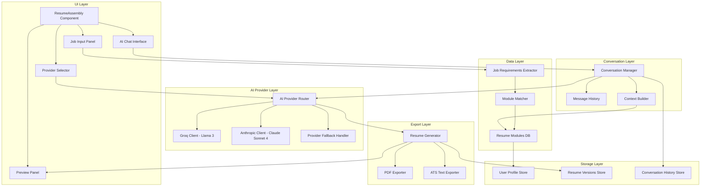
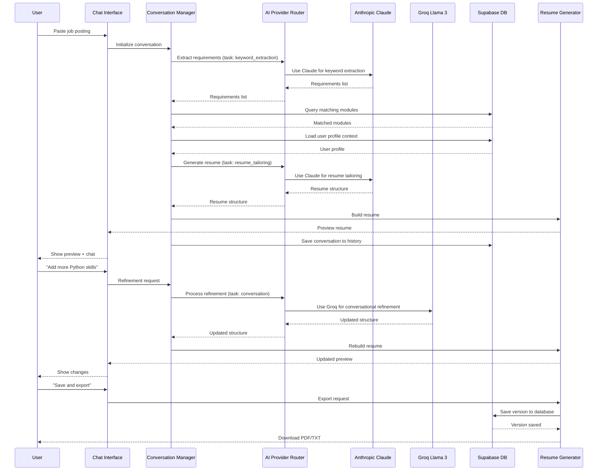

# Design Document: AI-Powered Conversational Resume Customization

## Overview

This feature adds an AI-powered conversational layer to the existing Resume Assembly view that automatically customizes resumes for specific job applications. Users paste a job posting URL or description, and the AI analyzes requirements, matches them against the user's resume module library (the "context brain"), generates a tailored resume, and allows conversational refinement. The system supports multiple AI providers with intelligent switching (Groq with Llama 3 for free testing, Anthropic Claude Sonnet 4 for production keyword extraction and resume tailoring), integrates deeply with Supabase for persisting user profiles and generated versions, and maintains the app's futuristic cyberpunk aesthetic while providing an intuitive, focused user experience.

The design follows a modular architecture with clear separation between AI processing, data matching, UI components, and conversation management. The AI provider abstraction layer enables seamless switching between providers based on task requirements and user preferences. The system is optimized for a 2-day development timeline with a working prototype as the primary deliverable.

## Architecture

The system architecture consists of six main layers: UI Layer (React components), Conversation Layer (chat interface and state management), AI Provider Layer (multi-provider abstraction with intelligent routing), Data Layer (Supabase + resume modules with persistence), Export Layer (PDF/TXT generation), and Storage Layer (user profiles and version history).



## Main Workflow

The user interaction follows a conversational flow with clear visual feedback at each stage. The AI Provider Router intelligently selects the best provider for each task.



## Components and Interfaces

### Component 1: AIProviderRouter

**Purpose**: Intelligent routing layer that selects the optimal AI provider based on task type, user preferences, and provider availability

**Interface**:
```typescript
interface AIProviderRouterConfig {
  providers: {
    groq?: { apiKey: string; model: string }
    anthropic?: { apiKey: string; model: string }
  }
  defaultProvider: 'groq' | 'anthropic'
  taskRouting: {
    keyword_extraction: 'groq' | 'anthropic'
    resume_tailoring: 'groq' | 'anthropic'
    conversation: 'groq' | 'anthropic'
  }
  fallbackEnabled: boolean
}

interface AIProviderRouter {
  route(task: AITask): Promise<AIResponse>
  switchProvider(provider: 'groq' | 'anthropic'): void
  getAvailableProviders(): string[]
  getCurrentProvider(): string
}

interface AITask {
  type: 'keyword_extraction' | 'resume_tailoring' | 'conversation'
  prompt: string
  context?: any
  options?: {
    temperature?: number
    maxTokens?: number
  }
}
```

**Responsibilities**:
- Route AI requests to appropriate provider based on task type
- Handle provider fallback when primary provider fails
- Manage API keys and authentication for multiple providers
- Track provider usage and performance metrics
- Allow user to manually switch providers via UI
- Implement retry logic with exponential backoff

**Provider Selection Logic**:
- Keyword extraction → Anthropic Claude (superior accuracy)
- Resume tailoring → Anthropic Claude (better structured output)
- Conversational refinement → Groq Llama 3 (faster, free tier)
- Fallback: If primary fails, try secondary provider

### Component 2: AIResumeCustomizer

**Purpose**: Main container component that orchestrates the AI-powered resume customization workflow

**Interface**:
```typescript
interface AIResumeCustomizerProps {
  user: User
  modules: ResumeModule[]
  onSaveVersion: (version: ResumeVersion) => Promise<void>
  aiProviderConfig: AIProviderRouterConfig
}

interface AIResumeCustomizerState {
  stage: 'input' | 'processing' | 'preview' | 'refining'
  jobPosting: string
  conversation: Message[]
  generatedResume: AssembledResume | null
  isProcessing: boolean
  error: string | null
  currentProvider: 'groq' | 'anthropic'
  userProfile: UserProfile | null
}
```

**Responsibilities**:
- Manage overall workflow state (input → processing → preview → refining)
- Coordinate between job input, AI processing, and preview panels
- Handle error states and loading indicators
- Persist conversation history to Supabase
- Trigger resume generation and export
- Load and cache user profile from Supabase
- Manage AI provider selection and switching

### Component 3: JobInputPanel

**Purpose**: Accepts job posting input (URL or text) and initiates AI analysis

**Interface**:
```typescript
interface JobInputPanelProps {
  onSubmit: (jobPosting: string) => void
  isProcessing: boolean
}

interface JobPosting {
  rawText: string
  url?: string
  extractedAt: Date
}
```

**Responsibilities**:
- Provide text area for job posting paste
- Support URL input with automatic content extraction
- Validate input before submission
- Show character count and input hints
- Display processing state with animated feedback

### Component 4: ConversationInterface

**Purpose**: Chat-style interface for conversational refinement of the resume

**Interface**:
```typescript
interface ConversationInterfaceProps {
  messages: Message[]
  onSendMessage: (content: string) => void
  isProcessing: boolean
  suggestedPrompts?: string[]
  currentProvider: 'groq' | 'anthropic'
}

interface Message {
  id: string
  role: 'user' | 'assistant' | 'system'
  content: string
  timestamp: Date
  provider: 'groq' | 'anthropic'
  metadata?: {
    requirementsExtracted?: Requirement[]
    modulesMatched?: string[]
    resumeGenerated?: boolean
  }
}
```

**Responsibilities**:
- Display message history with role-based styling
- Accept user input for refinement requests
- Show suggested prompts for common actions
- Display AI processing indicators with provider badge
- Render structured data (requirements, matched modules) in messages
- Auto-scroll to latest message
- Show which AI provider generated each response

### Component 5: ProviderSelector

**Purpose**: UI control for switching between AI providers

**Interface**:
```typescript
interface ProviderSelectorProps {
  currentProvider: 'groq' | 'anthropic'
  availableProviders: Array<{
    id: 'groq' | 'anthropic'
    name: string
    description: string
    isConfigured: boolean
  }>
  onProviderChange: (provider: 'groq' | 'anthropic') => void
  disabled: boolean
}
```

**Responsibilities**:
- Display available AI providers with status indicators
- Allow user to switch providers manually
- Show provider capabilities and limitations
- Indicate which provider is currently active
- Disable switching during active AI processing
- Show configuration status (API key present/missing)

### Component 6: ResumePreviewPanel

**Purpose**: Live preview of the generated/refined resume with export options

**Interface**:
```typescript
interface ResumePreviewPanelProps {
  resume: AssembledResume | null
  onExport: (format: 'pdf' | 'txt') => void
  onSaveVersion: (name: string) => void
  isExporting: boolean
}

interface AssembledResume {
  sections: ResumeSection[]
  metadata: {
    generatedAt: Date
    jobTitle: string
    company: string
    matchScore: number
    aiProvider: 'groq' | 'anthropic'
  }
}
```

**Responsibilities**:
- Render resume preview with proper formatting
- Highlight matched keywords from job posting
- Show match score and coverage metrics
- Provide export buttons (PDF, ATS-friendly TXT)
- Allow saving as named version to Supabase
- Support quick edits to sections
- Display which AI provider generated the resume

## Data Models

### UserProfile

Stored in Supabase, represents the user's "context brain"

```typescript
interface UserProfile {
  id: string
  user_id: string
  created_at: Date
  updated_at: Date
  profile_data: {
    name: string
    email: string
    phone: string
    location: string
    summary: string
    preferences: {
      preferredAIProvider: 'groq' | 'anthropic' | 'auto'
      resumeTone: 'professional' | 'casual' | 'technical'
      defaultExportFormat: 'pdf' | 'txt'
    }
  }
}
```

**Supabase Table**: `user_profiles`
**RLS Policy**: Users can only read/write their own profile
**Validation Rules**:
- user_id must reference auth.users
- profile_data.email must be valid email format
- updated_at automatically set on modification

### ResumeVersion

Stored in Supabase, represents saved resume versions

```typescript
interface ResumeVersion {
  id: string
  user_id: string
  created_at: Date
  version_name: string
  job_title: string
  company: string
  job_posting_url?: string
  job_posting_text: string
  resume_data: AssembledResume
  match_score: number
  ai_provider: 'groq' | 'anthropic'
  conversation_id?: string
  exported_formats: {
    pdf_url?: string
    txt_url?: string
  }
}
```

**Supabase Table**: `resume_versions`
**RLS Policy**: Users can only read/write their own versions
**Validation Rules**:
- user_id must reference auth.users
- version_name must be unique per user
- match_score must be between 0 and 100
- resume_data must be valid JSON

### ConversationHistory

Stored in Supabase, persists AI conversations

```typescript
interface ConversationHistory {
  id: string
  user_id: string
  created_at: Date
  updated_at: Date
  job_posting_text: string
  messages: Message[]
  context: ConversationContext
  resume_version_id?: string
}
```

**Supabase Table**: `conversation_history`
**RLS Policy**: Users can only read/write their own conversations
**Validation Rules**:
- user_id must reference auth.users
- messages must be valid JSON array
- updated_at automatically set on modification

### Requirement

Extracted from job posting by AI

```typescript
interface Requirement {
  type: 'skill' | 'experience' | 'education' | 'certification' | 'keyword'
  value: string
  priority: 'required' | 'preferred' | 'nice-to-have'
  matched: boolean
  matchedModuleIds: string[]
}
```

**Validation Rules**:
- type must be one of the defined enum values
- value must be non-empty string
- priority defaults to 'preferred' if not specified
- matched is computed based on matchedModuleIds length

### ConversationContext

Maintains state across conversation turns

```typescript
interface ConversationContext {
  jobPosting: JobPosting
  requirements: Requirement[]
  availableModules: ResumeModule[]
  selectedModuleIds: string[]
  userPreferences: {
    emphasize: string[]
    exclude: string[]
    tone: 'professional' | 'casual' | 'technical'
  }
  conversationHistory: Message[]
  aiProvider: 'groq' | 'anthropic'
}
```

**Validation Rules**:
- jobPosting.rawText must be at least 100 characters
- requirements array must contain at least 1 item after extraction
- selectedModuleIds must reference valid module IDs from availableModules
- userPreferences.emphasize and exclude must not overlap

### ResumeSection

Structured section in the generated resume

```typescript
interface ResumeSection {
  id: string
  type: 'summary' | 'experience' | 'education' | 'skills' | 'certifications' | 'custom'
  title: string
  content: ResumeSectionContent
  order: number
  sourceModuleIds: string[]
  matchedRequirements: string[]
}

type ResumeSectionContent = 
  | { type: 'text'; text: string }
  | { type: 'list'; items: string[] }
  | { type: 'experience'; entries: ExperienceEntry[] }
  | { type: 'education'; entries: EducationEntry[] }
```

**Validation Rules**:
- order must be unique within a resume
- sourceModuleIds must reference valid modules
- content must match the section type
- title must be non-empty

## Algorithmic Pseudocode

### Main Processing Algorithm

```pascal
ALGORITHM processJobPostingAndGenerateResume(jobPosting, userModules)
INPUT: jobPosting of type string, userModules of type ResumeModule[]
OUTPUT: result of type AssembledResume

BEGIN
  ASSERT jobPosting.length >= 100
  ASSERT userModules.length > 0
  
  // Step 1: Extract requirements from job posting
  requirements ← extractRequirements(jobPosting)
  ASSERT requirements.length > 0
  
  // Step 2: Match requirements against user modules
  matchedModules ← []
  FOR each requirement IN requirements DO
    matches ← findMatchingModules(requirement, userModules)
    FOR each match IN matches DO
      IF match NOT IN matchedModules THEN
        matchedModules.add(match)
        requirement.matchedModuleIds.add(match.id)
        requirement.matched ← true
      END IF
    END FOR
  END FOR
  
  // Step 3: Build context for AI
  context ← buildContext(jobPosting, requirements, matchedModules)
  
  // Step 4: Generate resume structure via AI
  resumeStructure ← callGroqAPI(context)
  
  // Step 5: Assemble final resume
  resume ← assembleResume(resumeStructure, matchedModules)
  
  ASSERT resume.sections.length > 0
  ASSERT resume.metadata.matchScore >= 0 AND resume.metadata.matchScore <= 100
  
  RETURN resume
END
```

**Preconditions**:
- jobPosting is a non-empty string with at least 100 characters
- userModules is a non-empty array of valid ResumeModule objects
- Groq API client is initialized and authenticated

**Postconditions**:
- Returns a valid AssembledResume object
- All sections have valid content and ordering
- Match score is calculated and within valid range (0-100)
- At least one requirement is matched (or error is thrown)

**Loop Invariants**:
- All processed requirements have valid matched status
- matchedModules contains no duplicates
- All matched module IDs reference valid modules

### Requirement Extraction Algorithm

```pascal
ALGORITHM extractRequirements(jobPosting)
INPUT: jobPosting of type string
OUTPUT: requirements of type Requirement[]

BEGIN
  // Step 1: Call AI to extract structured requirements
  prompt ← buildExtractionPrompt(jobPosting)
  aiResponse ← callGroqAPI(prompt)
  
  // Step 2: Parse AI response into structured format
  requirements ← []
  parsedData ← parseJSON(aiResponse)
  
  FOR each item IN parsedData.requirements DO
    requirement ← {
      type: item.type,
      value: item.value,
      priority: item.priority OR 'preferred',
      matched: false,
      matchedModuleIds: []
    }
    
    IF isValidRequirement(requirement) THEN
      requirements.add(requirement)
    END IF
  END FOR
  
  // Step 3: Deduplicate and normalize
  requirements ← deduplicateRequirements(requirements)
  
  RETURN requirements
END
```

**Preconditions**:
- jobPosting is non-empty string
- Groq API is accessible and responsive

**Postconditions**:
- Returns array of valid Requirement objects
- No duplicate requirements in the result
- All requirements have valid type and priority values

**Loop Invariants**:
- All added requirements pass validation
- No duplicates exist in requirements array at any iteration

### Module Matching Algorithm

```pascal
ALGORITHM findMatchingModules(requirement, userModules)
INPUT: requirement of type Requirement, userModules of type ResumeModule[]
OUTPUT: matches of type ResumeModule[]

BEGIN
  matches ← []
  searchTerms ← extractSearchTerms(requirement.value)
  
  FOR each module IN userModules DO
    score ← 0
    
    // Type matching
    IF module.type = requirement.type THEN
      score ← score + 10
    END IF
    
    // Content matching
    moduleText ← extractTextFromModule(module.content)
    FOR each term IN searchTerms DO
      IF moduleText CONTAINS term (case-insensitive) THEN
        score ← score + 5
      END IF
    END FOR
    
    // Threshold check
    IF score >= 10 THEN
      matches.add({module: module, score: score})
    END IF
  END FOR
  
  // Sort by score descending
  matches ← sortByScore(matches, descending)
  
  RETURN matches.map(m => m.module)
END
```

**Preconditions**:
- requirement is a valid Requirement object
- userModules is a non-empty array

**Postconditions**:
- Returns array of modules sorted by relevance score
- All returned modules have score >= threshold (10)
- Results are ordered by descending score

**Loop Invariants**:
- score is always non-negative
- All modules with score >= 10 are included in matches

### Conversational Refinement Algorithm

```pascal
ALGORITHM refineResumeWithConversation(userMessage, currentResume, context)
INPUT: userMessage of type string, currentResume of type AssembledResume, context of type ConversationContext
OUTPUT: updatedResume of type AssembledResume

BEGIN
  // Step 1: Parse user intent
  intent ← parseUserIntent(userMessage)
  
  // Step 2: Update context based on intent
  IF intent.type = 'add_section' THEN
    context.userPreferences.emphasize.add(intent.target)
  ELSE IF intent.type = 'remove_section' THEN
    context.userPreferences.exclude.add(intent.target)
  ELSE IF intent.type = 'modify_content' THEN
    // Handle content modification
  END IF
  
  // Step 3: Rebuild resume with updated context
  prompt ← buildRefinementPrompt(userMessage, currentResume, context)
  aiResponse ← callGroqAPI(prompt)
  updatedStructure ← parseJSON(aiResponse)
  
  // Step 4: Assemble updated resume
  updatedResume ← assembleResume(updatedStructure, context.availableModules)
  
  // Step 5: Update conversation history
  context.conversationHistory.add({
    role: 'user',
    content: userMessage,
    timestamp: now()
  })
  context.conversationHistory.add({
    role: 'assistant',
    content: generateResponseMessage(updatedResume, currentResume),
    timestamp: now()
  })
  
  RETURN updatedResume
END
```

**Preconditions**:
- userMessage is non-empty string
- currentResume is a valid AssembledResume object
- context contains valid conversation state

**Postconditions**:
- Returns updated AssembledResume reflecting user's request
- Conversation history is updated with new messages
- Context preferences are updated based on intent

**Loop Invariants**: N/A (no loops in main algorithm)

## Key Functions with Formal Specifications

### Function 1: routeAITask()

```typescript
async function routeAITask(
  task: AITask,
  config: AIProviderRouterConfig
): Promise<AIResponse>
```

**Preconditions:**
- task.type is one of: 'keyword_extraction', 'resume_tailoring', 'conversation'
- task.prompt is non-empty string
- At least one AI provider is configured in config.providers
- API keys are valid for configured providers

**Postconditions:**
- Returns non-empty AIResponse object
- Throws error if all providers fail
- Logs provider selection and performance metrics
- Falls back to secondary provider if primary fails

**Loop Invariants:** N/A

### Function 2: callGroqAPI()

```typescript
async function callGroqAPI(
  prompt: string,
  options?: {
    model?: string
    temperature?: number
    maxTokens?: number
  }
): Promise<string>
```

**Preconditions:**
- prompt is non-empty string
- GROQ_API_KEY environment variable is set
- options.temperature is between 0 and 2 (if provided)
- options.maxTokens is positive integer (if provided)

**Postconditions:**
- Returns non-empty string response from API
- Throws error if API call fails
- Response is valid JSON if prompt requests JSON format
- API rate limits are respected

**Loop Invariants:** N/A

### Function 3: callAnthropicAPI()

```typescript
async function callAnthropicAPI(
  prompt: string,
  options?: {
    model?: string
    temperature?: number
    maxTokens?: number
  }
): Promise<string>
```

**Preconditions:**
- prompt is non-empty string
- ANTHROPIC_API_KEY environment variable is set
- options.temperature is between 0 and 1 (if provided)
- options.maxTokens is positive integer (if provided)

**Postconditions:**
- Returns non-empty string response from API
- Throws error if API call fails
- Response is valid JSON if prompt requests JSON format
- API rate limits are respected

**Loop Invariants:** N/A

### Function 4: extractRequirements()

```typescript
async function extractRequirements(
  jobPosting: string,
  provider: 'groq' | 'anthropic' = 'anthropic'
): Promise<Requirement[]>
```

**Preconditions:**
- jobPosting is non-empty string with length >= 100
- Selected AI provider is accessible
- Provider API key is configured

**Postconditions:**
- Returns array of at least 1 Requirement object
- All requirements have valid type and priority
- No duplicate requirements in result
- All requirement values are non-empty strings

**Loop Invariants:**
- During parsing: all processed items are valid requirements
- During deduplication: no duplicates exist in processed subset

### Function 5: findMatchingModules()

```typescript
function findMatchingModules(
  requirement: Requirement,
  userModules: ResumeModule[]
): ResumeModule[]
```

**Preconditions:**
- requirement is valid Requirement object
- userModules is non-empty array of valid ResumeModule objects

**Postconditions:**
- Returns array of modules sorted by relevance score (descending)
- All returned modules have relevance score >= threshold
- No duplicate modules in result
- Original userModules array is not mutated

**Loop Invariants:**
- All modules with score >= threshold are included
- Scores are always non-negative
- No duplicates in matches array

### Function 6: assembleResume()

```typescript
function assembleResume(
  structure: ResumeStructure,
  modules: ResumeModule[]
): AssembledResume
```

**Preconditions:**
- structure contains valid section definitions
- modules array contains all referenced module IDs
- structure.sections have unique order values

**Postconditions:**
- Returns valid AssembledResume object
- All sections are properly ordered
- All sourceModuleIds reference valid modules
- metadata.matchScore is calculated and valid (0-100)

**Loop Invariants:**
- All processed sections have valid content
- Section order values remain unique
- All module references are valid

### Function 7: saveResumeVersion()

```typescript
async function saveResumeVersion(
  version: ResumeVersion,
  userId: string
): Promise<string>
```

**Preconditions:**
- version contains valid resume data
- userId references authenticated user
- version.version_name is unique for user
- Supabase client is initialized

**Postconditions:**
- Returns version ID from database
- Version is persisted to Supabase resume_versions table
- RLS policies are enforced
- Throws error if save fails

**Loop Invariants:** N/A

### Function 8: loadUserProfile()

```typescript
async function loadUserProfile(
  userId: string
): Promise<UserProfile>
```

**Preconditions:**
- userId references authenticated user
- Supabase client is initialized

**Postconditions:**
- Returns UserProfile object if exists
- Creates default profile if none exists
- RLS policies are enforced
- Throws error if database access fails

**Loop Invariants:** N/A

### Function 9: saveConversationHistory()

```typescript
async function saveConversationHistory(
  conversation: ConversationHistory,
  userId: string
): Promise<string>
```

**Preconditions:**
- conversation contains valid messages and context
- userId references authenticated user
- Supabase client is initialized

**Postconditions:**
- Returns conversation ID from database
- Conversation is persisted to Supabase conversation_history table
- RLS policies are enforced
- Throws error if save fails

**Loop Invariants:** N/A

### Function 10: buildContext()

```typescript
function buildContext(
  jobPosting: JobPosting,
  requirements: Requirement[],
  matchedModules: ResumeModule[],
  userProfile: UserProfile
): ConversationContext
```

**Preconditions:**
- jobPosting.rawText is non-empty
- requirements array is non-empty
- matchedModules contains valid modules
- userProfile is valid UserProfile object

**Postconditions:**
- Returns valid ConversationContext object
- All module IDs in selectedModuleIds are valid
- userPreferences are initialized from profile or defaults
- conversationHistory is empty array

**Loop Invariants:** N/A

## Example Usage

```typescript
// Example 1: Initialize AI Resume Customizer
const customizer = new AIResumeCustomizer({
  user: currentUser,
  modules: userResumeModules,
  onSaveVersion: async (version) => {
    await supabase.from('resume_versions').insert(version)
  }
})

// Example 2: Process job posting
const jobPosting = `
Senior Software Engineer at TechCorp
Requirements:
- 5+ years Python experience
- React and TypeScript
- AWS cloud services
- Team leadership
`

const result = await customizer.processJobPosting(jobPosting)
// result.requirements: [
//   { type: 'experience', value: '5+ years Python', priority: 'required', matched: true },
//   { type: 'skill', value: 'React', priority: 'required', matched: true },
//   { type: 'skill', value: 'TypeScript', priority: 'required', matched: false },
//   { type: 'skill', value: 'AWS', priority: 'required', matched: true },
//   { type: 'experience', value: 'Team leadership', priority: 'preferred', matched: true }
// ]

// Example 3: Conversational refinement
await customizer.sendMessage("Add more emphasis on my Python projects")
// AI updates resume to highlight Python-related experience

await customizer.sendMessage("Remove the Java skills section")
// AI removes Java skills from the generated resume

// Example 4: Export resume
await customizer.exportResume('pdf')
// Downloads: resume-techcorp-senior-software-engineer-2024-01-15.pdf

await customizer.exportResume('txt')
// Downloads: resume-techcorp-senior-software-engineer-2024-01-15.txt (ATS-friendly)

// Example 5: Save as version
await customizer.saveVersion('TechCorp Senior Engineer - Jan 2024')
// Saves to database with link to job application
```

## Error Handling

### Error Scenario 1: API Rate Limit Exceeded

**Condition**: Groq API returns 429 status code
**Response**: Display user-friendly message "AI service is busy. Please wait a moment and try again."
**Recovery**: Implement exponential backoff retry (1s, 2s, 4s) with max 3 attempts

### Error Scenario 2: Insufficient Module Matches

**Condition**: Less than 30% of requirements matched against user modules
**Response**: Show warning "Limited matches found. Consider adding more experience to your module library."
**Recovery**: Proceed with generation but highlight unmatched requirements in preview

### Error Scenario 3: Invalid Job Posting Input

**Condition**: Job posting text is too short (< 100 characters) or contains no extractable requirements
**Response**: Display validation error "Please provide a more detailed job posting with clear requirements."
**Recovery**: Keep input panel open, highlight validation error, suggest example format

### Error Scenario 4: AI Response Parsing Failure

**Condition**: AI returns malformed JSON or unexpected structure
**Response**: Log error details, show user message "Failed to process AI response. Please try again."
**Recovery**: Retry with simplified prompt, fallback to rule-based extraction if AI fails repeatedly

### Error Scenario 5: Export Generation Failure

**Condition**: PDF or TXT export fails due to missing data or formatting issues
**Response**: Display error "Export failed. Please check your resume content and try again."
**Recovery**: Validate resume structure, attempt export with fallback formatting, offer raw text download as last resort

## Testing Strategy

### Unit Testing Approach

Test individual functions in isolation with mocked dependencies:

- **extractRequirements()**: Test with various job posting formats, verify requirement extraction accuracy
- **findMatchingModules()**: Test scoring algorithm with different module types and content
- **assembleResume()**: Test section ordering, content formatting, metadata calculation
- **parseUserIntent()**: Test intent classification for various user messages
- **buildContext()**: Test context construction with different input combinations

Coverage goal: 80% for core business logic functions

### Property-Based Testing Approach

Use fast-check library to test invariants across random inputs:

**Property Test Library**: fast-check (JavaScript/TypeScript)

**Property 1: Requirement Extraction Idempotency**
```typescript
fc.assert(
  fc.property(fc.string({ minLength: 100 }), async (jobPosting) => {
    const req1 = await extractRequirements(jobPosting)
    const req2 = await extractRequirements(jobPosting)
    // Same input should produce same requirements
    expect(req1).toEqual(req2)
  })
)
```

**Property 2: Module Matching Score Monotonicity**
```typescript
fc.assert(
  fc.property(
    fc.array(fc.record({ type: fc.string(), content: fc.object() })),
    (modules) => {
      const matches = findMatchingModules(requirement, modules)
      // Scores should be in descending order
      for (let i = 0; i < matches.length - 1; i++) {
        expect(matches[i].score >= matches[i + 1].score).toBe(true)
      }
    }
  )
)
```

**Property 3: Resume Assembly Completeness**
```typescript
fc.assert(
  fc.property(
    fc.record({ sections: fc.array(fc.object()) }),
    fc.array(fc.object()),
    (structure, modules) => {
      const resume = assembleResume(structure, modules)
      // All sections should be present
      expect(resume.sections.length).toBe(structure.sections.length)
      // All sections should have valid order
      const orders = resume.sections.map(s => s.order)
      expect(new Set(orders).size).toBe(orders.length)
    }
  )
)
```

### Integration Testing Approach

Test component interactions and API integrations:

- **Groq API Integration**: Test with real API calls (rate-limited), verify response parsing
- **Database Operations**: Test module loading, version saving with test database
- **End-to-End Flow**: Test complete workflow from job posting input to resume export
- **Conversation Flow**: Test multi-turn conversations with state persistence

Use Vitest for test execution with jsdom for React component testing

## Performance Considerations

**AI Response Time**: Groq API typically responds in 1-3 seconds. Show loading indicators and progress messages to maintain user engagement.

**Module Matching Optimization**: For users with 100+ modules, implement client-side caching and indexing. Pre-compute module text representations on load.

**Conversation History**: Limit context sent to AI to last 10 messages to avoid token limits. Summarize older messages if needed.

**Export Generation**: Generate PDF/TXT asynchronously with progress indicator. Cache generated resumes for 5 minutes to allow quick re-downloads.

**Database Queries**: Use Supabase's built-in caching. Load modules once on component mount, update locally during session.

## Security Considerations

**API Key Protection**: Store Groq API key in environment variables, never expose in client code. Use server-side proxy for API calls if possible.

**Input Sanitization**: Sanitize job posting input to prevent XSS attacks. Validate all user inputs before processing.

**Data Privacy**: Job postings and generated resumes contain sensitive information. Ensure all data is associated with authenticated user, enforce RLS policies.

**Rate Limiting**: Implement client-side rate limiting (max 10 requests per minute) to prevent abuse and stay within free tier limits.

**Content Filtering**: Validate AI responses before rendering to prevent injection of malicious content.

## Dependencies

**External Services**:
- Groq API (free tier) - AI processing with Llama 3 model for conversational tasks
- Anthropic API (Claude Sonnet 4) - AI processing for keyword extraction and resume tailoring
- Supabase - Database, authentication, and storage

**NPM Packages**:
- @supabase/supabase-js (existing) - Database client
- @anthropic-ai/sdk (new) - Anthropic Claude API client
- react (existing) - UI framework
- lucide-react (existing) - Icons
- jspdf (existing) - PDF generation

**Internal Dependencies**:
- src/utils/smartResumeParser.js - Resume parsing utilities
- src/components/ResumeAssembly.jsx - Existing assembly view
- src/supabaseClient.js - Database client configuration

**Environment Variables Required**:
```bash
VITE_GROQ_API_KEY=your_groq_api_key_here
VITE_ANTHROPIC_API_KEY=your_anthropic_api_key_here
VITE_SUPABASE_URL=your_supabase_url
VITE_SUPABASE_ANON_KEY=your_supabase_anon_key
```

## Implementation Notes

**IMPORTANT: Existing Implementation Available**

A production-ready implementation already exists in `for Kiro/ResumeAssembly.jsx` with 95% of the required functionality:
- ✅ Claude API integration for keyword extraction and resume tailoring
- ✅ Supabase persistence (user_profiles, resume_versions)
- ✅ Three-phase AI workflow (extract → match → assemble)
- ✅ Edit/preview mode with live editing
- ✅ PDF and TXT export
- ✅ Version management
- ✅ Match score and skill gap analysis
- ✅ Cyberpunk UI with step indicators

**Integration Strategy:**

**Option A: Use Existing + Minor Enhancements (Recommended for 2-day timeline)**
- Deploy existing ResumeAssembly.jsx as-is
- Add Groq integration as optional enhancement later
- Focus on testing and polish

**Option B: Add AI Provider Router (3-4 days)**
- Integrate existing component with AI Provider Router
- Add Groq for conversational refinement
- Add provider selector UI
- Implement fallback logic

**Phase 1 (Day 1)**: Integration and setup
- Copy existing ResumeAssembly.jsx to src/components/
- Run Supabase migration (for Kiro/supabase_migration.sql)
- Add Claude API key to .env.local
- Test existing workflow end-to-end
- Fix any integration issues

**Phase 2 (Day 2)**: Polish and optional enhancements
- Add error handling improvements
- Implement conversation history persistence
- Add Groq integration for chat-based refinement (optional)
- Polish UI and add loading states
- Test with real job postings

**MVP Scope**: Use existing implementation with minimal changes. The current implementation already covers:
- Job posting analysis (paste or URL)
- AI-powered resume customization
- Match scoring and skill gap analysis
- Edit and export functionality
- Version management with Supabase

**AI Provider Strategy**:
- Current: Claude Sonnet 4 for all operations (extraction, matching, assembly)
- Future: Add Groq Llama 3 for conversational refinement
- Provider switching can be added as Phase 2 enhancement

**Supabase Schema** (Already defined in migration file):
```sql
-- user_profiles table
create table if not exists user_profiles (
  id uuid primary key default gen_random_uuid(),
  user_id uuid references auth.users(id) on delete cascade not null unique,
  name text,
  title text,
  location text,
  email text,
  phone text,
  linkedin text,
  summary text,
  skills text,
  experience text,
  education text,
  languages text,
  certifications text,
  projects text,
  created_at timestamptz default now(),
  updated_at timestamptz default now()
);

-- resume_versions table (enhanced)
alter table resume_versions
  add column if not exists content text,
  add column if not exists job_description text,
  add column if not exists analysis jsonb,
  add column if not exists user_id uuid references auth.users(id) on delete cascade;

-- RLS Policies
alter table user_profiles enable row level security;
create policy "Users manage own profile"
  on user_profiles for all
  using (auth.uid() = user_id)
  with check (auth.uid() = user_id);

alter table resume_versions enable row level security;
create policy "Users manage own resume versions"
  on resume_versions for all
  using (auth.uid() = user_id)
  with check (auth.uid() = user_id);
```

**Environment Variables Required**:
```bash
VITE_SUPABASE_URL=your_supabase_url
VITE_SUPABASE_ANON_KEY=your_supabase_anon_key
VITE_ANTHROPIC_API_KEY=your_anthropic_api_key_here
# Optional for Phase 2:
# VITE_GROQ_API_KEY=your_groq_api_key_here
```

**Future Enhancements** (Post-MVP):
- Add Groq integration for conversational refinement
- Implement AI provider router with automatic fallback
- Add conversation history persistence
- Build chat interface for iterative refinement
- A/B test different AI prompts and providers
- Add resume scoring and improvement suggestions
- Implement resume version comparison and diff view
- Add collaborative features (share resume versions)
- Build resume template library
- Implement job application tracking integration
