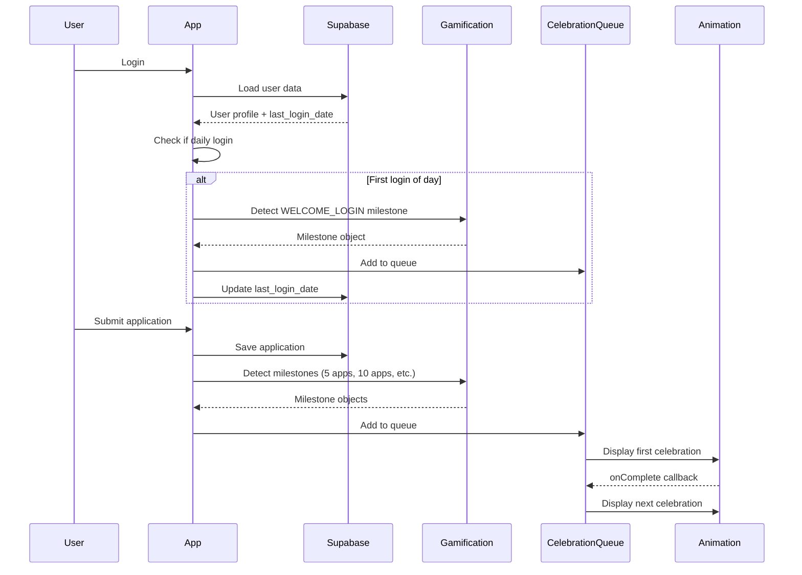

# Design Document: Enhanced Unicorn Celebrations

## Overview

This feature enhances the existing gamification system by adding unicorn celebration animations for daily login welcome events and early application milestones (5 and 10 applications). The implementation extends the current milestone detection system in `src/gamification.js`, integrates with the celebration animation system in `src/components/CelebrationAnimation.jsx`, and adds daily login tracking with database persistence.

The design follows the existing architecture pattern where:
- Pure gamification logic resides in `gamification.js` (no side effects, no UI coupling)
- Celebration triggering and queue management happens in `App.jsx`
- Animation rendering is handled by `CelebrationAnimation.jsx`

Key enhancements include:
1. Two new milestone types: `WELCOME_LOGIN` and `FIVE_APPLICATIONS`
2. Daily login tracking with timezone-aware date comparison
3. Enhanced celebration queue to handle the new milestone types
4. Database schema extension for last login date tracking

## Architecture

### System Components

The feature integrates with three main components:

1. **Gamification Engine** (`src/gamification.js`)
   - Pure functions for milestone detection
   - New milestone type constants
   - Extended `detectMilestones()` function to check for new milestone types

2. **Application Controller** (`src/App.jsx`)
   - Daily login detection on user authentication
   - Celebration queue management
   - Database persistence for login tracking
   - Milestone triggering coordination

3. **Celebration System** (`src/components/CelebrationAnimation.jsx`)
   - Existing animation rendering (no changes required)
   - Already supports 'standard' tier used by new milestones

### Data Flow



### Integration Points

1. **Database Schema Extension**
   - Add `last_login_date` column to `gamification_state` table
   - Type: `DATE` (stores date only, no time component)
   - Used for daily login detection

2. **Gamification Module Extension**
   - Add new constants to `MILESTONES` object
   - Add new entries to `MILESTONE_TIERS` mapping
   - Add new entries to `MILESTONE_MESSAGES` mapping
   - Extend `detectMilestones()` function with new detection logic

3. **App.jsx Enhancement**
   - Add daily login detection in `loadGamificationState()` or new `checkDailyLogin()` function
   - Extend celebration queue to handle all milestone tiers (currently filters to rank-up and achievement only)
   - Add database update for last login date

## Components and Interfaces

### Gamification Module Extensions

#### New Constants

```javascript
const MILESTONES = {
  // ... existing milestones
  WELCOME_LOGIN: 'welcome_login',
  FIVE_APPLICATIONS: 'five_applications',
};

const MILESTONE_TIERS = {
  // ... existing tiers
  [MILESTONES.WELCOME_LOGIN]: 'standard',
  [MILESTONES.FIVE_APPLICATIONS]: 'standard',
};

const MILESTONE_MESSAGES = {
  // ... existing messages
  [MILESTONES.WELCOME_LOGIN]: {
    title: 'Welcome Back!',
    message: 'Ready to make progress today?',
  },
  [MILESTONES.FIVE_APPLICATIONS]: {
    title: '5 Applications!',
    message: 'Great start! Keep the momentum going!',
  },
};
```

#### Extended detectMilestones Function

The `detectMilestones()` function signature remains unchanged but adds new detection logic:

```javascript
/**
 * Detect milestones based on old state vs new state
 * @param {Object} oldState - Previous gamification state
 * @param {Object} newState - New gamification state
 * @param {Array} applications - Current applications array
 * @param {Object} options - Optional parameters (e.g., isDailyLogin)
 * @returns {Array} Array of milestone objects { type, tier, title, message }
 */
export function detectMilestones(oldState, newState, applications, options = {})
```

New detection logic:
- Check `options.isDailyLogin` flag for welcome celebration
- Check `applications.length === 5` for five applications milestone
- Existing check for `applications.length === 10` continues to work

### Daily Login Detection

#### New Function: checkDailyLogin

```javascript
/**
 * Check if current login is the first of the day
 * @param {string|null} lastLoginDate - ISO date string (YYYY-MM-DD) or null
 * @param {Date} currentDate - Current date (defaults to now)
 * @returns {boolean} True if this is first login of the day
 */
export function checkDailyLogin(lastLoginDate, currentDate = new Date())
```

Implementation approach:
- Compare dates in user's local timezone
- Normalize both dates to midnight (00:00:00)
- Return true if dates differ or lastLoginDate is null
- Return false if dates are the same

### Celebration Queue Enhancement

Current implementation in `App.jsx`:

```javascript
const celebrationMilestones = milestones.filter(
  m => m.tier === 'rank-up' || m.tier === 'achievement'
);
```

Enhanced implementation:

```javascript
const celebrationMilestones = milestones.filter(
  m => m.tier === 'rank-up' || m.tier === 'achievement' || m.tier === 'standard'
);
```

This change enables all milestone types to trigger celebrations, not just rank-up and achievement tiers.

### Database Schema

#### gamification_state Table Extension

Add new column:

```sql
ALTER TABLE gamification_state
ADD COLUMN last_login_date DATE;
```

Column properties:
- Type: `DATE` (not TIMESTAMP - we only care about the day)
- Nullable: Yes (null means never logged in before)
- Default: NULL
- Updated: On every login after daily login check

## Data Models

### Milestone Object

```typescript
interface Milestone {
  type: string;           // e.g., 'welcome_login', 'five_applications'
  tier: MilestoneTier;    // 'rank-up' | 'achievement' | 'standard'
  title: string;          // Display title
  message: string;        // Display message
}

type MilestoneTier = 'rank-up' | 'achievement' | 'standard';
```

### Gamification State Extension

```typescript
interface GamificationState {
  user_id: string;
  points: number;
  streak_days: number;
  last_activity: string;      // ISO date string
  rank: string;
  last_login_date: string | null;  // NEW: ISO date string (YYYY-MM-DD)
}
```

### Detection Options

```typescript
interface DetectionOptions {
  isDailyLogin?: boolean;  // Flag to trigger welcome celebration
}
```

## Correctness Properties

*A property is a characteristic or behavior that should hold true across all valid executions of a system-essentially, a formal statement about what the system should do. Properties serve as the bridge between human-readable specifications and machine-verifiable correctness guarantees.*


### Property Reflection

After analyzing all acceptance criteria, I identified several areas of redundancy:

1. **Tier Configuration Properties (1.3, 2.2, 3.2, 4.2)**: All test that milestone types map to correct tiers. These can be consolidated into a single property that validates the tier mapping for all milestone types.

2. **Queue Addition Properties (1.5, 2.5, 3.5)**: All test that milestones get added to the celebration queue. This is redundant with property 5.1 which tests that all detected milestones get queued.

3. **Single Trigger Properties (2.4, 3.4)**: Both test that application count milestones only trigger once. These can be combined into a single property about application milestone uniqueness.

4. **Daily Login Detection Properties (6.1, 6.2, 6.4)**: These all test aspects of the checkDailyLogin function. They can be consolidated into properties about the function's behavior.

5. **Constant Definition Examples (7.1, 7.2, 7.3, 7.4)**: These are all simple constant checks that can be verified with unit tests rather than properties.

After consolidation, we have the following unique properties:

### Property 1: Daily Login Detection

*For any* pair of dates (last login date and current date), the checkDailyLogin function should return true if and only if the dates represent different calendar days in the user's local timezone.

**Validates: Requirements 1.1, 1.2, 6.2, 6.3, 6.4**

### Property 2: Welcome Milestone Triggering

*For any* gamification state, when detectMilestones is called with the isDailyLogin flag set to true, it should include a WELCOME_LOGIN milestone in the returned array.

**Validates: Requirements 1.1, 7.5**

### Property 3: Milestone Tier Mapping

*For any* milestone type constant (WELCOME_LOGIN, FIVE_APPLICATIONS, TEN_APPLICATIONS, RANK_UP, etc.), the MILESTONE_TIERS mapping should return the correct tier value as specified in the requirements.

**Validates: Requirements 1.3, 2.2, 3.2, 4.2**

### Property 4: Five Applications Milestone Detection

*For any* gamification state and applications array, when the applications array length equals exactly 5, detectMilestones should include a FIVE_APPLICATIONS milestone in the returned array.

**Validates: Requirements 2.1, 7.5**

### Property 5: Ten Applications Milestone Detection

*For any* gamification state and applications array, when the applications array length equals exactly 10, detectMilestones should include a TEN_APPLICATIONS milestone in the returned array.

**Validates: Requirements 3.1**

### Property 6: Application Milestone Uniqueness

*For any* gamification state and applications array, when the applications array length is greater than a milestone threshold (5 or 10), detectMilestones should NOT include that milestone in the returned array (milestones trigger only once at the exact count).

**Validates: Requirements 2.4, 3.4**

### Property 7: Rank-Up Milestone Preservation

*For any* gamification state transition where the rank changes, detectMilestones should include a RANK_UP milestone with the correct tier ('rank-up') in the returned array.

**Validates: Requirements 4.1, 4.2, 4.3**

### Property 8: Multiple Milestone Queueing

*For any* set of detected milestones, all milestones should be added to the celebration queue in the order they were detected, regardless of their tier.

**Validates: Requirements 4.4, 5.1, 5.4**

### Property 9: Celebration Queue Filtering

*For any* milestone with tier 'standard', 'achievement', or 'rank-up', it should be included in the celebration queue (not filtered out).

**Validates: Requirements 1.5, 2.5, 3.5**

### Property 10: Date Normalization Idempotence

*For any* date, normalizing it to midnight (00:00:00) multiple times should produce the same result as normalizing it once.

**Validates: Requirements 6.3**

## Error Handling

### Daily Login Detection Errors

1. **Null Last Login Date**
   - Scenario: User has never logged in before (last_login_date is NULL)
   - Handling: Treat as first daily login, return true from checkDailyLogin
   - Result: Welcome celebration triggers

2. **Invalid Date Format**
   - Scenario: Database contains malformed date string
   - Handling: Catch parsing errors, log warning, treat as first daily login
   - Result: Welcome celebration triggers, date gets corrected on next update

3. **Future Date in Database**
   - Scenario: last_login_date is in the future (clock skew or manual edit)
   - Handling: Treat as different day, allow welcome celebration
   - Result: System self-corrects on next login

### Milestone Detection Errors

1. **Missing Applications Array**
   - Scenario: detectMilestones called with null/undefined applications
   - Handling: Default to empty array, no application milestones detected
   - Result: Only non-application milestones (welcome, rank-up) can trigger

2. **Inconsistent State**
   - Scenario: Applications count doesn't match gamification points
   - Handling: Trust applications array as source of truth
   - Result: Milestones based on actual application count

3. **Rapid Milestone Triggering**
   - Scenario: Multiple milestones detected simultaneously (e.g., 5th app + rank up)
   - Handling: Queue all milestones, display sequentially
   - Result: User sees all earned celebrations

### Database Errors

1. **Failed Login Date Update**
   - Scenario: Database update for last_login_date fails
   - Handling: Log error, continue with application flow
   - Result: User may see welcome celebration again on next login (acceptable degradation)

2. **Connection Loss During Update**
   - Scenario: Network interruption during database write
   - Handling: Supabase client handles retry logic
   - Result: Update eventually succeeds or fails gracefully

## Testing Strategy

### Dual Testing Approach

This feature requires both unit tests and property-based tests for comprehensive coverage:

**Unit Tests** focus on:
- Specific examples of daily login detection (same day, different day, null date)
- Exact milestone messages and titles (Requirements 1.4, 2.3, 3.3)
- Constant definitions (Requirements 7.1-7.4)
- Edge cases (future dates, invalid formats)
- Integration points (database updates, queue management)

**Property-Based Tests** focus on:
- Universal properties across all date combinations (Property 1, 10)
- Milestone detection across all state combinations (Properties 2, 4, 5, 6, 7)
- Queue behavior across all milestone combinations (Properties 8, 9)
- Tier mapping for all milestone types (Property 3)

### Property-Based Testing Configuration

**Library Selection**: 
- JavaScript: Use `fast-check` library (mature, well-documented, TypeScript support)
- Installation: `npm install --save-dev fast-check`

**Test Configuration**:
- Minimum 100 iterations per property test
- Each test tagged with feature name and property number
- Tag format: `Feature: enhanced-unicorn-celebrations, Property {N}: {property_text}`

**Example Test Structure**:

```javascript
import fc from 'fast-check';
import { checkDailyLogin } from './gamification';

describe('Feature: enhanced-unicorn-celebrations', () => {
  test('Property 1: Daily login detection', () => {
    fc.assert(
      fc.property(
        fc.date(), // last login date
        fc.date(), // current date
        (lastLogin, currentDate) => {
          const result = checkDailyLogin(
            lastLogin.toISOString().split('T')[0],
            currentDate
          );
          
          // Normalize dates to midnight
          const lastDay = new Date(lastLogin);
          lastDay.setHours(0, 0, 0, 0);
          const currentDay = new Date(currentDate);
          currentDay.setHours(0, 0, 0, 0);
          
          // Result should be true iff dates are different days
          const expected = lastDay.getTime() !== currentDay.getTime();
          return result === expected;
        }
      ),
      { numRuns: 100 }
    );
  });
});
```

### Unit Test Coverage

**gamification.js**:
- `checkDailyLogin()`: Same day, different day, null input, future date
- `detectMilestones()`: Welcome login flag, 5 apps, 10 apps, rank-up preservation
- Constant definitions: WELCOME_LOGIN, FIVE_APPLICATIONS exist and have correct values
- Message mappings: Correct titles and messages for new milestones

**App.jsx**:
- Daily login detection on user load
- Celebration queue filtering includes 'standard' tier
- Database update for last_login_date
- Multiple milestone queueing

**Integration Tests**:
- Full flow: Login → Welcome celebration → Add 5 apps → Celebration
- Queue processing: Multiple milestones display sequentially
- Database persistence: last_login_date survives page reload

### Test Data Generators

For property-based tests, we need generators for:

1. **Date Generator**: Random dates within reasonable range (past 2 years to future 1 day)
2. **Gamification State Generator**: Valid state objects with random points, ranks, streaks
3. **Applications Array Generator**: Arrays of varying lengths (0-20) with valid application objects
4. **Milestone Type Generator**: Random selection from all milestone type constants

### Edge Cases to Cover

1. **Timezone Boundaries**: Login at 11:59 PM vs 12:01 AM
2. **Leap Years**: February 29th login dates
3. **DST Transitions**: Dates around daylight saving time changes
4. **Simultaneous Milestones**: 5th app that also triggers rank-up
5. **Rapid Logins**: Multiple logins within seconds
6. **First Ever Login**: Null last_login_date
7. **Application Count Boundaries**: Exactly 5, exactly 10, 4, 6, 9, 11

### Testing Priorities

1. **Critical Path** (Must have 100% coverage):
   - Daily login detection logic
   - Milestone detection for new types
   - Celebration queue filtering

2. **Important** (Should have high coverage):
   - Date normalization
   - Error handling for invalid dates
   - Multiple milestone queueing

3. **Nice to Have** (Can have moderate coverage):
   - Database update error handling
   - UI state management edge cases

## Implementation Notes

### Phase 1: Database Schema
1. Add `last_login_date` column to `gamification_state` table
2. Run migration on production database
3. Verify column exists and accepts NULL values

### Phase 2: Gamification Module
1. Add new constants (WELCOME_LOGIN, FIVE_APPLICATIONS)
2. Add tier mappings and messages
3. Implement `checkDailyLogin()` function
4. Extend `detectMilestones()` with new logic
5. Write unit tests and property tests

### Phase 3: App.jsx Integration
1. Add daily login detection in `loadGamificationState()`
2. Update celebration queue filtering
3. Add database update for last_login_date
4. Test integration with existing celebration system

### Phase 4: Testing & Validation
1. Run all unit tests
2. Run all property-based tests (100+ iterations each)
3. Manual testing of celebration flows
4. Verify database updates persist correctly

### Rollout Considerations

1. **Backward Compatibility**: Existing users with NULL last_login_date will see welcome celebration on first login after deployment (acceptable)
2. **Performance**: Daily login check adds minimal overhead (single date comparison)
3. **Database Load**: One additional column read/write per login (negligible impact)
4. **User Experience**: More celebrations may feel overwhelming - monitor user feedback

### Future Enhancements

1. **Celebration Preferences**: Allow users to disable certain celebration types
2. **Celebration History**: Track which celebrations user has seen
3. **Custom Messages**: Personalize celebration messages based on user data
4. **Animation Variety**: Different unicorn colors or styles for different milestone types
