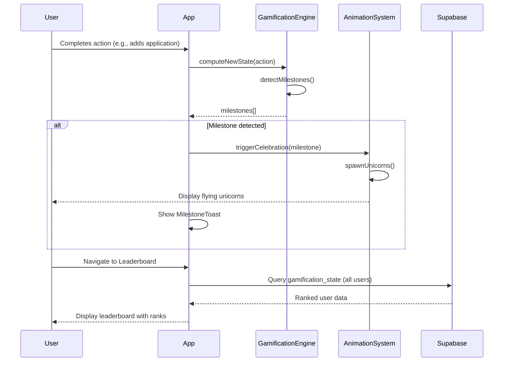
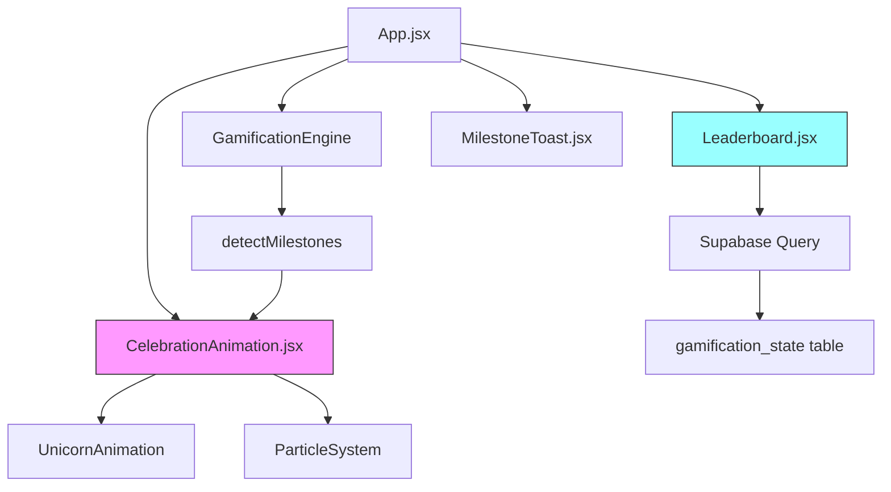

# Design Document: Gamification Enhancements

## Overview

This feature adds celebration animations and a leaderboard system to the existing job tracker application. When users reach milestones, unicorns will fly across the screen as a celebratory animation. A new leaderboard page will display rankings of all users based on their points, fostering healthy competition and motivation.

## Main Algorithm/Workflow



## Architecture



## Components and Interfaces

### Component 1: CelebrationAnimation

**Purpose**: Renders flying unicorn animations when milestones are achieved

**Interface**:
```typescript
interface CelebrationAnimationProps {
  milestone: Milestone
  onComplete: () => void
}

interface Milestone {
  type: string
  tier: 'rank-up' | 'achievement' | 'standard'
  title: string
  message: string
}
```

**Responsibilities**:
- Spawn multiple unicorn elements at random positions
- Animate unicorns flying across the screen
- Clean up animation elements after completion
- Trigger callback when animation finishes

### Component 2: Leaderboard

**Purpose**: Displays ranked list of all users with their points and ranks

**Interface**:
```typescript
interface LeaderboardProps {
  currentUserId: string
}

interface LeaderboardEntry {
  user_id: string
  rank: string
  points: number
  streak_days: number
  position: number
}
```

**Responsibilities**:
- Fetch all users' gamification data from Supabase
- Sort users by points (descending)
- Calculate position/ranking (1st, 2nd, 3rd, etc.)
- Highlight current user's entry
- Display rank badges and point totals
- Handle loading and error states

### Component 3: UnicornSprite

**Purpose**: Individual animated unicorn element

**Interface**:
```typescript
interface UnicornSpriteProps {
  startX: number
  startY: number
  duration: number
  delay: number
  onAnimationEnd: () => void
}
```

**Responsibilities**:
- Render unicorn emoji or SVG
- Apply CSS animation for flight path
- Self-remove after animation completes

## Data Models

### LeaderboardEntry

```typescript
interface LeaderboardEntry {
  user_id: string
  rank: string
  points: number
  streak_days: number
  position: number
  is_current_user: boolean
}
```

**Validation Rules**:
- user_id must be valid UUID
- rank must be one of the defined ranks from gamification.js
- points must be non-negative integer
- streak_days must be non-negative integer
- position must be positive integer

### CelebrationConfig

```typescript
interface CelebrationConfig {
  unicornCount: number
  duration: number
  spawnInterval: number
  trajectories: TrajectoryType[]
}

type TrajectoryType = 'diagonal' | 'arc' | 'wave' | 'straight'
```

**Validation Rules**:
- unicornCount: 3-10 unicorns per celebration
- duration: 2-5 seconds per unicorn
- spawnInterval: 100-300ms between spawns
- trajectories: at least one trajectory type

## Algorithmic Pseudocode

### Main Celebration Trigger Algorithm

```pascal
ALGORITHM triggerCelebration(milestone)
INPUT: milestone of type Milestone
OUTPUT: void (side effect: animation displayed)

BEGIN
  // Determine celebration intensity based on milestone tier
  config ← getCelebrationConfig(milestone.tier)
  
  // Initialize animation state
  activeUnicorns ← []
  
  // Spawn unicorns with staggered timing
  FOR i FROM 0 TO config.unicornCount - 1 DO
    delay ← i * config.spawnInterval
    trajectory ← config.trajectories[i MOD length(config.trajectories)]
    
    unicorn ← createUnicornSprite({
      startX: random(0, windowWidth),
      startY: random(windowHeight * 0.3, windowHeight * 0.7),
      trajectory: trajectory,
      duration: config.duration,
      delay: delay
    })
    
    activeUnicorns.add(unicorn)
    
    // Schedule cleanup
    setTimeout(() => {
      removeUnicorn(unicorn)
      activeUnicorns.remove(unicorn)
    }, delay + config.duration * 1000)
  END FOR
  
  // Trigger completion callback after all unicorns finish
  totalDuration ← (config.unicornCount - 1) * config.spawnInterval + config.duration * 1000
  setTimeout(() => {
    IF onComplete IS NOT NULL THEN
      onComplete()
    END IF
  }, totalDuration)
END
```

**Preconditions:**
- milestone is non-null and has valid tier property
- Window/viewport dimensions are available
- DOM is ready for element insertion

**Postconditions:**
- Unicorn elements are added to DOM
- Animations are triggered with correct timing
- All elements are cleaned up after completion
- onComplete callback is invoked exactly once

**Loop Invariants:**
- Each iteration creates exactly one unicorn sprite
- Delay increases monotonically with each iteration
- activeUnicorns contains all currently animating unicorns

### Leaderboard Data Fetch Algorithm

```pascal
ALGORITHM fetchLeaderboardData(currentUserId)
INPUT: currentUserId of type UUID
OUTPUT: leaderboardEntries of type LeaderboardEntry[]

BEGIN
  // Query all users' gamification state
  rawData ← supabase
    .from('gamification_state')
    .select('user_id, rank, points, streak_days')
    .order('points', { ascending: false })
  
  IF rawData.error THEN
    THROW Error("Failed to fetch leaderboard data")
  END IF
  
  // Transform and rank the data
  leaderboardEntries ← []
  
  FOR i FROM 0 TO length(rawData) - 1 DO
    entry ← rawData[i]
    
    leaderboardEntry ← {
      user_id: entry.user_id,
      rank: entry.rank,
      points: entry.points,
      streak_days: entry.streak_days,
      position: i + 1,
      is_current_user: entry.user_id = currentUserId
    }
    
    leaderboardEntries.add(leaderboardEntry)
  END FOR
  
  RETURN leaderboardEntries
END
```

**Preconditions:**
- currentUserId is a valid UUID
- Supabase client is initialized and authenticated
- gamification_state table exists and is accessible

**Postconditions:**
- Returns array of leaderboard entries sorted by points (descending)
- Each entry has correct position (1-indexed)
- Current user's entry is marked with is_current_user = true
- If query fails, throws descriptive error

**Loop Invariants:**
- Position equals loop index + 1
- All processed entries are added to leaderboardEntries
- Data remains sorted by points in descending order

### Celebration Config Selection Algorithm

```pascal
ALGORITHM getCelebrationConfig(tier)
INPUT: tier of type string ('rank-up' | 'achievement' | 'standard')
OUTPUT: config of type CelebrationConfig

BEGIN
  IF tier = 'rank-up' THEN
    RETURN {
      unicornCount: 8,
      duration: 4,
      spawnInterval: 200,
      trajectories: ['diagonal', 'arc', 'wave', 'straight']
    }
  ELSE IF tier = 'achievement' THEN
    RETURN {
      unicornCount: 5,
      duration: 3,
      spawnInterval: 250,
      trajectories: ['diagonal', 'arc']
    }
  ELSE
    // Standard tier
    RETURN {
      unicornCount: 3,
      duration: 2.5,
      spawnInterval: 300,
      trajectories: ['straight', 'diagonal']
    }
  END IF
END
```

**Preconditions:**
- tier is one of: 'rank-up', 'achievement', or 'standard'

**Postconditions:**
- Returns valid CelebrationConfig object
- Higher tier milestones get more intense celebrations
- All config values are within valid ranges

## Key Functions with Formal Specifications

### Function 1: spawnUnicorn()

```typescript
function spawnUnicorn(config: UnicornConfig): HTMLElement
```

**Preconditions:**
- config.startX is between 0 and window.innerWidth
- config.startY is between 0 and window.innerHeight
- config.duration is positive number
- config.trajectory is valid trajectory type

**Postconditions:**
- Returns HTMLElement representing unicorn
- Element is appended to document.body
- CSS animation is applied based on trajectory
- Element has unique ID for cleanup

**Loop Invariants:** N/A (no loops)

### Function 2: calculateLeaderboardPosition()

```typescript
function calculateLeaderboardPosition(
  entries: GamificationState[], 
  userId: string
): number
```

**Preconditions:**
- entries is non-empty array
- entries is sorted by points in descending order
- userId is valid UUID string

**Postconditions:**
- Returns 1-indexed position of user in leaderboard
- Returns -1 if user not found
- Position reflects actual rank (ties handled by order)

**Loop Invariants:**
- For each iteration, all previous entries have been checked
- Position counter increments by 1 each iteration

### Function 3: cleanupCelebration()

```typescript
function cleanupCelebration(unicornIds: string[]): void
```

**Preconditions:**
- unicornIds is array of valid element IDs
- All IDs correspond to existing DOM elements

**Postconditions:**
- All unicorn elements are removed from DOM
- No memory leaks from event listeners
- Animation timers are cleared

**Loop Invariants:**
- Each iteration removes exactly one element
- All previously processed elements are no longer in DOM

## Example Usage

```typescript
// Example 1: Trigger celebration on milestone
const milestone = {
  type: 'RANK_UP',
  tier: 'rank-up',
  title: 'Rank Up: Interviewer!',
  message: "You've advanced to Interviewer. Keep climbing!"
}

<CelebrationAnimation 
  milestone={milestone}
  onComplete={() => console.log('Celebration finished')}
/>

// Example 2: Display leaderboard
<Leaderboard currentUserId={user.id} />

// Example 3: Manual celebration trigger
const handleMilestone = (milestone) => {
  if (milestone.tier === 'rank-up' || milestone.tier === 'achievement') {
    setCelebrationActive(true)
    setActiveMilestone(milestone)
  }
}

// Example 4: Leaderboard data fetching
const loadLeaderboard = async () => {
  const { data, error } = await supabase
    .from('gamification_state')
    .select('user_id, rank, points, streak_days')
    .order('points', { ascending: false })
    .limit(100)
  
  if (!error) {
    setLeaderboardData(data.map((entry, index) => ({
      ...entry,
      position: index + 1,
      is_current_user: entry.user_id === user.id
    })))
  }
}
```

## Correctness Properties

*A property is a characteristic or behavior that should hold true across all valid executions of a system—essentially, a formal statement about what the system should do. Properties serve as the bridge between human-readable specifications and machine-verifiable correctness guarantees.*

### Property 1: Celebration Uniqueness

*For any* milestone, triggering a celebration should result in exactly one celebration animation being displayed.

**Validates: Requirements 1.1**

### Property 2: Callback Invocation Uniqueness

*For any* celebration animation, when it completes, the onComplete callback should be invoked exactly once.

**Validates: Requirements 1.5**

### Property 3: Unicorn Position Bounds

*For any* spawned unicorn sprite, its starting position should be within the viewport boundaries (0 ≤ x ≤ window.innerWidth and 0 ≤ y ≤ window.innerHeight).

**Validates: Requirements 2.1**

### Property 4: Staggered Spawn Timing

*For any* celebration with multiple unicorns, the time interval between consecutive unicorn spawns should be between 100ms and 300ms.

**Validates: Requirements 2.4**

### Property 5: Complete Animation Cleanup

*For any* celebration animation, after it completes, the DOM should contain zero unicorn elements.

**Validates: Requirements 2.5, 6.1**

### Property 6: Unicorn Count Bounds

*For any* celebration configuration, the unicorn count should be between 3 and 10 (inclusive).

**Validates: Requirements 5.5, 6.3**

### Property 7: Leaderboard Ordering Invariant

*For any* leaderboard data, entries should be sorted by points in descending order (for any two entries at positions i and j where i < j, entry[i].points ≥ entry[j].points).

**Validates: Requirements 3.2, 7.1**

### Property 8: Data Transformation Validity

*For any* raw leaderboard data from the database, transforming it should produce valid LeaderboardEntry objects with all required fields (user_id, rank, points, streak_days, position, is_current_user).

**Validates: Requirements 3.3**

### Property 9: Position Starts at One

*For any* non-empty leaderboard, the highest-scoring user (first entry) should have position value equal to 1.

**Validates: Requirements 3.5**

### Property 10: Rendered Fields Completeness

*For any* leaderboard entry, the rendered output should contain the user's position, rank, points, and streak_days.

**Validates: Requirements 4.1**

### Property 11: Current User Highlighting

*For any* leaderboard containing the current user, that user's entry should have visual highlighting applied.

**Validates: Requirements 4.2**

### Property 12: Position Consistency

*For any* leaderboard entry at array index i, its position value should equal i + 1.

**Validates: Requirements 4.3, 7.2**

### Property 13: Valid Trajectory Types

*For any* celebration configuration, the trajectory types array should contain only valid trajectory values ('diagonal', 'arc', 'wave', 'straight').

**Validates: Requirements 5.4**

### Property 14: Unique Current User Marking

*For any* leaderboard with a current user, exactly one entry should have is_current_user set to true, and that entry's user_id should match the currentUserId.

**Validates: Requirements 7.3**

### Property 15: Valid UUID Format

*For any* leaderboard entry, the user_id field should be a valid UUID format.

**Validates: Requirements 7.5**

### Property 16: Data Privacy Field Filtering

*For any* leaderboard entry displayed to users, only the fields user_id, rank, points, and streak_days should be visible (no email, personal info, etc.).

**Validates: Requirements 9.2**

### Property 17: Leaderboard Caching Behavior

*For any* sequence of leaderboard fetch requests within a 30-second window, only the first request should hit the database, and subsequent requests should return cached data.

**Validates: Requirements 10.2**

### Property 18: Request Debouncing

*For any* rapid sequence of leaderboard refresh requests, the actual number of database queries should be less than the number of requests due to debouncing.

**Validates: Requirements 10.4**

## Error Handling

### Error Scenario 1: Leaderboard Fetch Failure

**Condition**: Supabase query fails due to network error or permission issue
**Response**: Display error message to user, show retry button
**Recovery**: User can click retry to attempt fetch again, or navigate away

### Error Scenario 2: Animation Performance Issues

**Condition**: Too many unicorns cause frame rate drops on low-end devices
**Response**: Reduce unicorn count dynamically based on detected performance
**Recovery**: Subsequent celebrations use reduced unicorn count

### Error Scenario 3: Missing Gamification State

**Condition**: User's gamification_state row doesn't exist when loading leaderboard
**Response**: Initialize default state for user, then reload leaderboard
**Recovery**: System creates missing row and continues normally

### Error Scenario 4: Celebration During Navigation

**Condition**: User navigates away while celebration animation is active
**Response**: Cancel ongoing animations, clean up DOM elements
**Recovery**: Animation state is reset, no memory leaks

## Testing Strategy

### Unit Testing Approach

Test individual functions in isolation:
- `getCelebrationConfig()`: Verify correct config for each tier
- `calculateLeaderboardPosition()`: Test with various user positions
- `spawnUnicorn()`: Verify DOM element creation and properties
- `cleanupCelebration()`: Ensure all elements are removed

Mock Supabase client for database operations.

### Property-Based Testing Approach

**Property Test Library**: fast-check (for JavaScript/TypeScript)

Test properties with randomly generated inputs:
- Leaderboard ordering property: Generate random point values, verify sorting
- Position consistency property: Generate random leaderboard sizes, verify positions
- Animation cleanup property: Generate random unicorn counts, verify all are removed
- Celebration uniqueness property: Trigger multiple milestones, verify no duplicates

### Integration Testing Approach

Test component interactions:
- Milestone detection → Celebration trigger → Animation display
- Leaderboard fetch → Data transformation → UI rendering
- User action → Gamification update → Leaderboard refresh

Use React Testing Library for component testing.

## Performance Considerations

- Limit maximum unicorns to 10 to prevent performance degradation
- Use CSS transforms for animations (GPU-accelerated)
- Debounce leaderboard refreshes to avoid excessive queries
- Implement virtual scrolling for leaderboards with 100+ users
- Cache leaderboard data for 30 seconds to reduce database load
- Use `will-change` CSS property for animated elements
- Clean up animation elements immediately after completion

## Security Considerations

- Leaderboard queries use Row Level Security (RLS) in Supabase
- Only fetch public gamification data (no email addresses or personal info)
- Prevent SQL injection by using Supabase client's parameterized queries
- Rate limit leaderboard API calls to prevent abuse
- Validate all user inputs before database operations
- Ensure users can only see anonymized leaderboard data (user IDs only)

## Dependencies

- React 18.3.1 (existing)
- Supabase JS client 2.48.0 (existing)
- lucide-react 0.469.0 (existing, for icons)
- CSS animations (no additional library needed)
- No new external dependencies required
