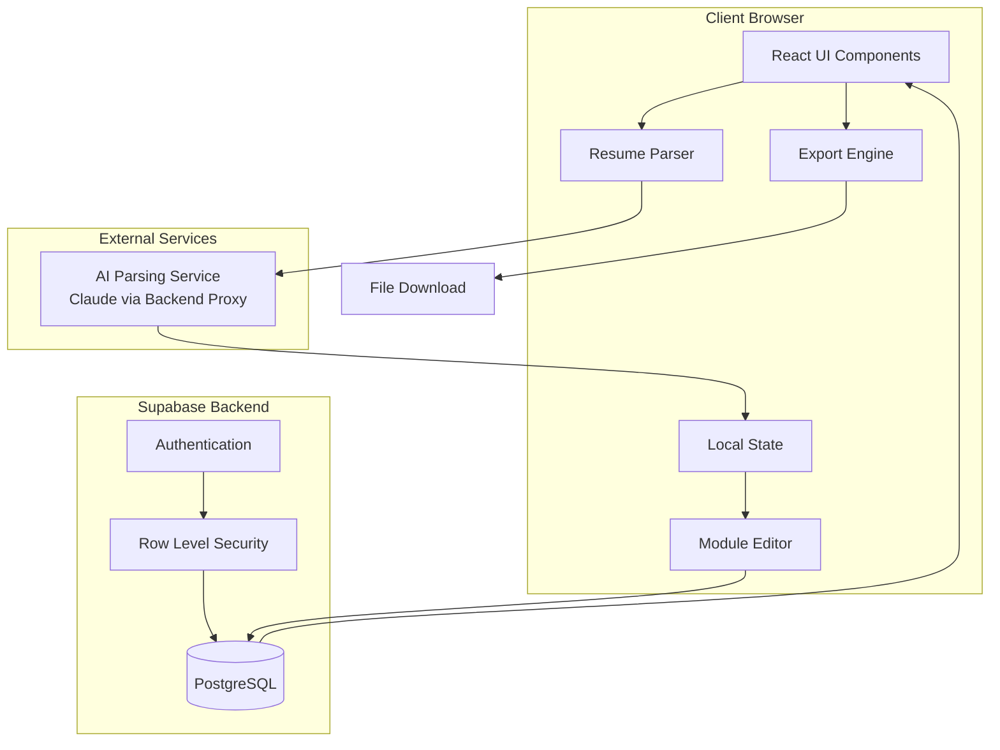
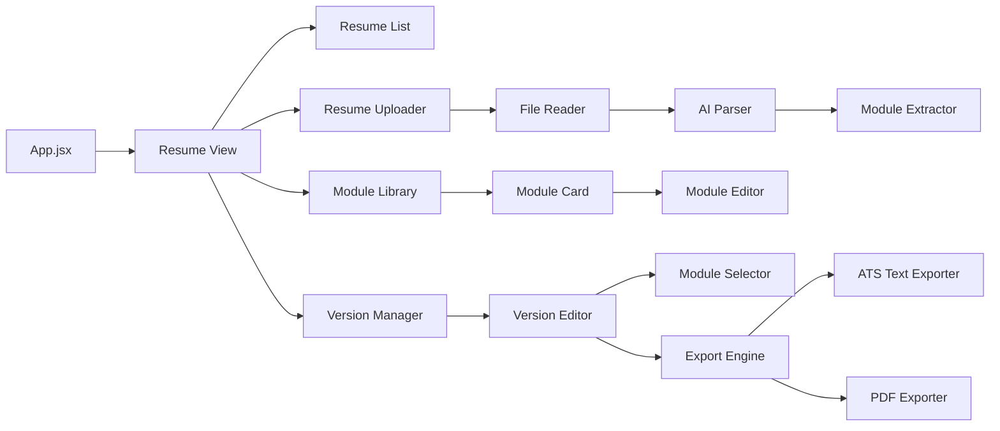

# Design Document: Resume Builder & Manager

## Overview

The Resume Builder & Manager is a comprehensive client-side application that enables job applicants to efficiently create, manage, and customize multiple versions of their resumes. The system parses uploaded resumes into modular components, allows editing of individual modules, stores multiple resume versions in Supabase PostgreSQL, and exports resumes in both ATS-friendly text and formatted PDF formats.

### Key Design Goals

1. **Client-Side Processing**: Minimize server costs by performing resume parsing and PDF generation in the browser
2. **Modular Architecture**: Break resumes into discrete, reusable components (experience entries, skills, education)
3. **Version Management**: Support multiple resume variants for different job applications
4. **Export Flexibility**: Generate both machine-readable (ATS) and human-readable (PDF) formats
5. **Integration**: Seamlessly link resume versions to job applications in the existing tracker
6. **Theme Consistency**: Match the existing futuristic cyberpunk aesthetic

### Technology Stack

- **Frontend**: React 18 + Vite
- **Backend**: Supabase (PostgreSQL + Auth)
- **Styling**: Custom CSS with cyberpunk theme
- **Icons**: Lucide React
- **Resume Parsing**: Client-side text extraction + AI parsing (Claude API via backend proxy)
- **PDF Generation**: jsPDF + jsPDF-AutoTable (client-side)
- **File Reading**: FileReader API for PDF/DOCX/TXT

## Architecture

### System Architecture Diagram



### Component Architecture



### Data Flow

1. **Upload Flow**: User uploads file → FileReader extracts text → AI parses structure → Modules saved to DB
2. **Edit Flow**: User selects module → Editor loads data → User modifies → Changes saved to DB
3. **Version Creation Flow**: User creates version → Selects modules → Configuration saved to DB
4. **Export Flow**: User selects version → System loads modules → Export engine generates file → Browser downloads

## Components and Interfaces

### 1. Resume View Component

**Purpose**: Main container for all resume management functionality

**Props**:
```typescript
interface ResumeViewProps {
  user: User;
  currentView: 'applications' | 'resumes' | 'leaderboard';
  onViewChange: (view: string) => void;
}
```

**State**:
- `resumes`: Array of resume versions
- `modules`: Array of all resume modules
- `selectedResume`: Currently selected resume version
- `selectedModule`: Currently selected module for editing
- `viewMode`: 'list' | 'edit' | 'create' | 'export'

**Key Methods**:
- `loadResumes()`: Fetch all resume versions from DB
- `loadModules()`: Fetch all modules from DB
- `createNewVersion()`: Initialize new resume version
- `deleteVersion(id)`: Remove resume version

### 2. Resume Uploader Component

**Purpose**: Handle file upload and initial parsing

**Props**:
```typescript
interface ResumeUploaderProps {
  onResumeProcessed: (data: ParsedResumeData) => void;
  isProcessing: boolean;
  setIsProcessing: (processing: boolean) => void;
}
```

**Features**:
- Drag-and-drop file upload
- File type validation (PDF, DOCX, TXT)
- File size validation (max 5MB)
- Progress indication during parsing
- Error handling and user feedback

**File Reading Strategy**:
- **PDF**: Use FileReader to read as DataURL, extract text client-side using pdf.js
- **DOCX**: Use mammoth.js to extract text from DOCX files
- **TXT**: Direct text reading via FileReader

**Parsing Strategy**:
- Extract raw text from file
- Send to backend proxy endpoint that calls Claude API
- Backend endpoint keeps API key secure
- Parse AI response into structured modules
- Validate module structure before saving

### 3. Module Library Component

**Purpose**: Display and manage all resume modules

**Props**:
```typescript
interface ModuleLibraryProps {
  modules: Module[];
  onModuleSelect: (module: Module) => void;
  onModuleEdit: (module: Module) => void;
  onModuleDelete: (moduleId: string) => void;
  searchQuery: string;
  filterType: 'all' | 'experience' | 'education' | 'skills' | 'custom';
}
```

**Features**:
- Grid/list view toggle
- Search functionality
- Filter by module type
- Sort by date created/modified
- Bulk selection for version creation
- Module preview cards

### 4. Module Editor Component

**Purpose**: Edit individual resume modules

**Props**:
```typescript
interface ModuleEditorProps {
  module: Module | null;
  onSave: (module: Module) => void;
  onCancel: () => void;
  mode: 'create' | 'edit';
}
```

**Module Types**:

**Experience Module**:
```typescript
interface ExperienceModule {
  id: string;
  type: 'experience';
  company: string;
  position: string;
  location?: string;
  startDate: string;
  endDate: string | 'Present';
  achievements: string[];
  technologies?: string[];
}
```

**Education Module**:
```typescript
interface EducationModule {
  id: string;
  type: 'education';
  institution: string;
  degree: string;
  field: string;
  startDate: string;
  endDate: string;
  gpa?: string;
  honors?: string[];
}
```

**Skills Module**:
```typescript
interface SkillsModule {
  id: string;
  type: 'skills';
  category: string; // 'technical', 'soft', 'languages', 'tools'
  skills: string[];
}
```

**Custom Module**:
```typescript
interface CustomModule {
  id: string;
  type: 'custom';
  title: string;
  content: string;
  format: 'text' | 'list' | 'table';
}
```

### 5. Version Manager Component

**Purpose**: Create and manage resume versions

**Props**:
```typescript
interface VersionManagerProps {
  version: ResumeVersion | null;
  allModules: Module[];
  onSave: (version: ResumeVersion) => void;
  onCancel: () => void;
  mode: 'create' | 'edit' | 'clone';
}
```

**Features**:
- Version naming
- Module selection with drag-and-drop reordering
- Module order customization
- Template selection
- Preview mode
- Completeness validation

### 6. Export Engine Component

**Purpose**: Generate downloadable resume files

**Props**:
```typescript
interface ExportEngineProps {
  version: ResumeVersion;
  modules: Module[];
  format: 'ats' | 'pdf';
  template?: PDFTemplate;
  onExportComplete: () => void;
}
```

**ATS Export Strategy**:
- Plain text format
- Clear section headers (EXPERIENCE, EDUCATION, SKILLS)
- No special characters or formatting
- Standard date formats
- Bullet points as hyphens
- Filename: `{version_name}_ATS.txt`

**PDF Export Strategy**:
- Use jsPDF for PDF generation
- Use jsPDF-AutoTable for structured layouts
- Apply template styling (fonts, colors, spacing)
- Support multiple templates
- Filename: `{version_name}.pdf`

### 7. Keyword Matcher Component

**Purpose**: Analyze job descriptions and match keywords

**Props**:
```typescript
interface KeywordMatcherProps {
  version: ResumeVersion;
  modules: Module[];
  jobDescription: string;
  onKeywordAnalysisComplete: (analysis: KeywordAnalysis) => void;
}
```

**Algorithm**:
1. Extract keywords from job description (NLP-based)
2. Filter common words (stop words)
3. Identify technical skills, tools, qualifications
4. Search resume content for matches
5. Highlight matched/unmatched keywords
6. Suggest modules to add unmatched keywords

### 8. Version Comparison Component

**Purpose**: Compare two resume versions side-by-side

**Props**:
```typescript
interface VersionComparisonProps {
  versionA: ResumeVersion;
  versionB: ResumeVersion;
  modulesA: Module[];
  modulesB: Module[];
  onCopyModule: (from: 'A' | 'B', to: 'A' | 'B', moduleId: string) => void;
}
```

**Features**:
- Side-by-side layout
- Highlight differences
- Module presence indicators
- Content diff visualization
- Copy modules between versions

## Data Models

### Database Schema

```sql
-- Resume Versions Table
CREATE TABLE resume_versions (
  id UUID PRIMARY KEY DEFAULT uuid_generate_v4(),
  user_id UUID NOT NULL REFERENCES auth.users(id) ON DELETE CASCADE,
  name VARCHAR(255) NOT NULL,
  template_id VARCHAR(50) DEFAULT 'default',
  module_order JSONB NOT NULL, -- Array of module IDs in display order
  created_at TIMESTAMP WITH TIME ZONE DEFAULT NOW(),
  updated_at TIMESTAMP WITH TIME ZONE DEFAULT NOW(),
  CONSTRAINT unique_user_resume_name UNIQUE(user_id, name)
);

-- Resume Modules Table
CREATE TABLE resume_modules (
  id UUID PRIMARY KEY DEFAULT uuid_generate_v4(),
  user_id UUID NOT NULL REFERENCES auth.users(id) ON DELETE CASCADE,
  type VARCHAR(50) NOT NULL CHECK (type IN ('experience', 'education', 'skills', 'custom', 'summary', 'certification')),
  title VARCHAR(255),
  content JSONB NOT NULL, -- Flexible structure based on module type
  created_at TIMESTAMP WITH TIME ZONE DEFAULT NOW(),
  updated_at TIMESTAMP WITH TIME ZONE DEFAULT NOW()
);

-- Version-Module Junction Table (for many-to-many relationship)
CREATE TABLE version_modules (
  version_id UUID NOT NULL REFERENCES resume_versions(id) ON DELETE CASCADE,
  module_id UUID NOT NULL REFERENCES resume_modules(id) ON DELETE CASCADE,
  display_order INTEGER NOT NULL,
  PRIMARY KEY (version_id, module_id)
);

-- Update applications table to link resume versions
ALTER TABLE applications
ADD COLUMN resume_version_id UUID REFERENCES resume_versions(id) ON DELETE SET NULL;

-- Indexes for performance
CREATE INDEX idx_resume_versions_user ON resume_versions(user_id);
CREATE INDEX idx_resume_modules_user ON resume_modules(user_id);
CREATE INDEX idx_resume_modules_type ON resume_modules(type);
CREATE INDEX idx_version_modules_version ON version_modules(version_id);
CREATE INDEX idx_version_modules_module ON version_modules(module_id);
CREATE INDEX idx_applications_resume_version ON applications(resume_version_id);

-- Row Level Security Policies
ALTER TABLE resume_versions ENABLE ROW LEVEL SECURITY;
ALTER TABLE resume_modules ENABLE ROW LEVEL SECURITY;
ALTER TABLE version_modules ENABLE ROW LEVEL SECURITY;

CREATE POLICY "Users can view own resume versions"
  ON resume_versions FOR SELECT
  USING (auth.uid() = user_id);

CREATE POLICY "Users can insert own resume versions"
  ON resume_versions FOR INSERT
  WITH CHECK (auth.uid() = user_id);

CREATE POLICY "Users can update own resume versions"
  ON resume_versions FOR UPDATE
  USING (auth.uid() = user_id);

CREATE POLICY "Users can delete own resume versions"
  ON resume_versions FOR DELETE
  USING (auth.uid() = user_id);

CREATE POLICY "Users can view own modules"
  ON resume_modules FOR SELECT
  USING (auth.uid() = user_id);

CREATE POLICY "Users can insert own modules"
  ON resume_modules FOR INSERT
  WITH CHECK (auth.uid() = user_id);

CREATE POLICY "Users can update own modules"
  ON resume_modules FOR UPDATE
  USING (auth.uid() = user_id);

CREATE POLICY "Users can delete own modules"
  ON resume_modules FOR DELETE
  USING (auth.uid() = user_id);

CREATE POLICY "Users can manage version-module links"
  ON version_modules FOR ALL
  USING (
    EXISTS (
      SELECT 1 FROM resume_versions
      WHERE id = version_modules.version_id
      AND user_id = auth.uid()
    )
  );
```

### TypeScript Interfaces

```typescript
// Core Types
interface User {
  id: string;
  email: string;
}

interface ResumeVersion {
  id: string;
  user_id: string;
  name: string;
  template_id: string;
  module_order: string[]; // Array of module IDs
  created_at: string;
  updated_at: string;
}

interface Module {
  id: string;
  user_id: string;
  type: 'experience' | 'education' | 'skills' | 'custom' | 'summary' | 'certification';
  title: string;
  content: ExperienceContent | EducationContent | SkillsContent | CustomContent | SummaryContent | CertificationContent;
  created_at: string;
  updated_at: string;
}

// Content Types
interface ExperienceContent {
  company: string;
  position: string;
  location?: string;
  startDate: string;
  endDate: string | 'Present';
  achievements: string[];
  technologies?: string[];
}

interface EducationContent {
  institution: string;
  degree: string;
  field: string;
  startDate: string;
  endDate: string;
  gpa?: string;
  honors?: string[];
}

interface SkillsContent {
  category: string;
  skills: string[];
}

interface CustomContent {
  format: 'text' | 'list' | 'table';
  data: string | string[] | Record<string, string>[];
}

interface SummaryContent {
  text: string;
}

interface CertificationContent {
  name: string;
  issuer: string;
  date: string;
  expiryDate?: string;
  credentialId?: string;
}

// Version-Module Link
interface VersionModule {
  version_id: string;
  module_id: string;
  display_order: number;
}

// Export Types
interface PDFTemplate {
  id: string;
  name: string;
  industry: string;
  fonts: {
    heading: string;
    body: string;
  };
  colors: {
    primary: string;
    secondary: string;
    text: string;
  };
  spacing: {
    sectionGap: number;
    lineHeight: number;
  };
}

interface KeywordAnalysis {
  matched: string[];
  unmatched: string[];
  suggestions: {
    keyword: string;
    suggestedModules: string[];
  }[];
}

// Parsed Resume Data
interface ParsedResumeData {
  filename: string;
  summary?: string;
  experience: ExperienceContent[];
  education: EducationContent[];
  skills: {
    technical?: string[];
    soft?: string[];
    languages?: string[];
    tools?: string[];
  };
  certifications?: string[];
}
```

## Correctness Properties

*A property is a characteristic or behavior that should hold true across all valid executions of a system—essentially, a formal statement about what the system should do. Properties serve as the bridge between human-readable specifications and machine-verifiable correctness guarantees.*


### Property Reflection

After analyzing all 75 acceptance criteria, I've identified several areas of redundancy that can be consolidated:

**Redundancy Analysis**:

1. **Module Structure Validation (2.1, 2.2, 2.3)**: All three properties test that modules contain required fields. These can be combined into one comprehensive property about module data integrity.

2. **Export Completeness (5.5, 6.3)**: Both test that all selected modules appear in exports. These can be combined into one property that applies to both ATS and PDF formats.

3. **Export Filename Format (5.4, 6.4)**: Both test filename conventions. These can be combined into one property with format-specific patterns.

4. **Module Display (3.1, 14.1)**: Both test that modules are displayed correctly. These can be combined into one property about module rendering.

5. **Filtering Properties (15.1, 15.2, 15.3)**: All three test filtering functionality. These can be combined into one comprehensive filtering property.

6. **Keyword Matching Display (9.3, 9.4)**: Both test keyword display. These can be combined into one property about keyword visualization.

7. **Version Comparison Highlighting (10.2, 10.3)**: Both test difference highlighting. These can be combined into one comprehensive comparison property.

8. **Template Application (11.3, 11.5)**: Both test that templates apply their styling. These can be combined into one property.

9. **Cover Letter Export (12.4)**: This is redundant with general export properties and can be covered by the same export completeness property.

10. **Completeness Validation (13.1, 13.2)**: Both test validation and warning display. These can be combined into one property.

After consolidation, we reduce from 75 testable criteria to approximately 45 unique properties, eliminating redundancy while maintaining comprehensive coverage.

### Correctness Properties

#### Parsing and Import Properties

### Property 1: Multi-Format Resume Parsing

*For any* resume file in PDF, DOCX, or TXT format, parsing should extract structured data containing at least one of: experience, education, or skills sections.

**Validates: Requirements 1.1, 1.2**

### Property 2: Unsupported Format Error Handling

*For any* file with an unsupported format (not PDF, DOCX, or TXT), the parser should return an error message indicating the supported formats.

**Validates: Requirements 1.3**

### Property 3: Parsing Fallback to Manual Entry

*For any* resume file where parsing fails to extract structured data, the system should allow manual module creation without blocking the user.

**Validates: Requirements 1.4**

### Property 4: Original Content Preservation

*For any* parsed resume section, the original text content should be preserved exactly in the stored module data.

**Validates: Requirements 1.5**

#### Module Management Properties

### Property 5: Module Data Integrity

*For any* module created (experience, education, or skills), it should contain all required fields for its type: experience modules must have company, position, and dates; education modules must have institution, degree, and dates; skills modules must have category and skills array.

**Validates: Requirements 2.1, 2.2, 2.3**

### Property 6: Default Version Creation

*For any* successfully parsed resume, a default resume version should be created containing all extracted modules.

**Validates: Requirements 2.4**

### Property 7: Module ID Uniqueness

*For any* set of modules belonging to a user, all module IDs should be unique.

**Validates: Requirements 2.5**

### Property 8: Module Content Editability

*For any* module selected for editing, its content should be displayed in an editable interface and modifications should be saveable.

**Validates: Requirements 3.1**

### Property 9: Required Field Validation

*For any* module with required fields, attempting to save with empty required fields should be rejected with a validation error.

**Validates: Requirements 3.2**

### Property 10: Module Update Propagation

*For any* module that is updated, all resume versions containing that module should reflect the updated content.

**Validates: Requirements 3.3**

### Property 11: Rich Text Format Preservation

*For any* module content with rich text formatting (bold, italic, bullet points), the formatting should be preserved in the stored data and displayed correctly when retrieved.

**Validates: Requirements 3.4**

#### Version Management Properties

### Property 12: Module Selection Flexibility

*For any* resume version, users should be able to include or exclude any subset of their available modules.

**Validates: Requirements 4.2**

### Property 13: Version List Completeness

*For any* user, viewing their resume list should display all their saved resume versions with names and last modified timestamps.

**Validates: Requirements 4.3**

### Property 14: Version Cloning Accuracy

*For any* resume version that is cloned, the new version should contain references to exactly the same modules in the same order as the original.

**Validates: Requirements 4.4, 8.1**

### Property 15: Version Deletion Module Preservation

*For any* resume version that is deleted, all modules referenced by that version should remain in the database and be available for other versions.

**Validates: Requirements 4.5**

### Property 16: Version Renaming

*For any* resume version, renaming it should update the name field while preserving all other version data including module references and order.

**Validates: Requirements 4.6**

### Property 17: Clone Name Differentiation

*For any* resume version that is cloned, the new version's name should be the original name with " Copy" appended.

**Validates: Requirements 8.2**

#### Export Properties

### Property 18: ATS Format Compliance

*For any* resume version exported as ATS format, the output should be plain text with clear section headers and no special characters, tables, or complex formatting.

**Validates: Requirements 5.1, 5.2**

### Property 19: ATS Section Ordering

*For any* resume version exported as ATS format, sections should appear in the standard order: contact information, summary, experience, education, skills.

**Validates: Requirements 5.3**

### Property 20: Export Filename Convention

*For any* resume version exported, the filename should follow the pattern "{version_name}_ATS.txt" for ATS exports and "{version_name}.pdf" for PDF exports.

**Validates: Requirements 5.4, 6.4**

### Property 21: Export Module Completeness

*For any* resume version exported (ATS or PDF), all modules selected in that version should appear in the exported file.

**Validates: Requirements 5.5, 6.3**

### Property 22: PDF Generation Validity

*For any* resume version exported as PDF, the output should be a valid PDF document that can be opened by standard PDF readers.

**Validates: Requirements 6.1**

### Property 23: PDF Formatting Consistency

*For any* resume version exported as PDF, the document should apply consistent typography, spacing, and layout throughout all sections.

**Validates: Requirements 6.2**

#### Application Integration Properties

### Property 24: Resume Version Linking

*For any* job application, users should be able to associate it with a resume version, and that association should be stored and retrievable.

**Validates: Requirements 7.1, 7.5**

### Property 25: Linked Resume Display

*For any* job application with a linked resume version, viewing the application should display the resume version name.

**Validates: Requirements 7.2**

### Property 26: Deleted Resume Reference Handling

*For any* resume version that is deleted, all job applications previously linked to it should display "Resume Deleted" instead of the version name.

**Validates: Requirements 7.4**

#### Keyword Matching Properties

### Property 27: Keyword Extraction

*For any* job description text provided, the keyword matcher should extract at least one relevant keyword or required skill, excluding common words like articles and prepositions.

**Validates: Requirements 9.1, 9.5**

### Property 28: Keyword Matching Accuracy

*For any* set of extracted keywords and resume version content, the matcher should correctly identify which keywords appear in the resume and which do not.

**Validates: Requirements 9.2**

### Property 29: Keyword Visualization

*For any* keyword analysis result, matched keywords should be visually distinguished from unmatched keywords, and unmatched keywords should include suggestions for relevant modules.

**Validates: Requirements 9.3, 9.4**

#### Version Comparison Properties

### Property 30: Comparison Difference Detection

*For any* two resume versions being compared, the system should correctly identify and highlight modules that appear in only one version or have different content between versions.

**Validates: Requirements 10.2, 10.3**

### Property 31: Comparison Difference Count

*For any* two resume versions being compared, the summary count of differences should equal the actual number of modules that differ between the versions.

**Validates: Requirements 10.4**

### Property 32: Cross-Version Module Copy

*For any* module in a version comparison, copying it from one version to another should add that module to the target version without modifying the source version.

**Validates: Requirements 10.5**

#### Template Properties

### Property 33: Template Application to PDF

*For any* resume version with a selected template, PDF exports should apply that template's formatting rules including fonts, colors, and layout.

**Validates: Requirements 11.3, 11.5**

### Property 34: Template Switching Content Preservation

*For any* resume version, switching from one template to another should preserve all module content and only change the formatting applied during export.

**Validates: Requirements 11.4**

#### Cover Letter Properties (Future Phase)

### Property 35: Cover Letter Resume Linking

*For any* cover letter created, it should be linkable to a specific resume version, and that link should be stored and retrievable.

**Validates: Requirements 12.1**

### Property 36: Cover Letter Template Variable Substitution

*For any* cover letter with template variables (company name, position title), exporting should replace those variables with actual data from the linked job application.

**Validates: Requirements 12.3**

### Property 37: Cover Letter Multi-Format Export

*For any* cover letter, exporting should generate both PDF and plain text formats containing the same content.

**Validates: Requirements 12.4**

### Property 38: Cover Letter Storage

*For any* user, multiple cover letter versions should be storable, each associated with a different resume version.

**Validates: Requirements 12.5**

#### Validation Properties

### Property 39: Export Completeness Validation

*For any* resume version being exported, the system should check for the presence of contact information, experience, and education modules, and display a warning listing any missing critical sections.

**Validates: Requirements 13.1, 13.2**

### Property 40: Export Warning Override

*For any* resume version with missing critical sections, users should be able to proceed with export despite the warning.

**Validates: Requirements 13.3**

### Property 41: Completeness Indicator Accuracy

*For any* resume version being viewed, the completeness indicator should accurately show which standard sections (contact, experience, education, skills) are present.

**Validates: Requirements 13.4**

#### Module Ordering Properties

### Property 42: Module Order Isolation

*For any* resume version where modules are reordered, the new order should only affect that specific version and not affect the module order in other versions.

**Validates: Requirements 14.2**

### Property 43: Export Order Preservation

*For any* resume version exported (ATS or PDF), modules should appear in the same order as configured in the version's module_order array.

**Validates: Requirements 14.3**

### Property 44: Module Type Grouping

*For any* resume version, modules should be groupable by type such that all experience modules appear together, all education modules appear together, etc.

**Validates: Requirements 14.4**

### Property 45: New Module Default Placement

*For any* new module added to a resume version, it should be placed at the end of its type group by default.

**Validates: Requirements 14.5**

#### Search and Filter Properties

### Property 46: Module Search Filtering

*For any* search query entered, only modules containing the search text in their title or content should be displayed in the filtered results.

**Validates: Requirements 15.1**

### Property 47: Module Type and Date Filtering

*For any* combination of type filter and date range filter applied, only modules matching both criteria should be displayed, and the count should accurately reflect the number of matching modules.

**Validates: Requirements 15.2, 15.3, 15.4**

### Property 48: Filtered Module Addition

*For any* module in filtered search results, users should be able to add it directly to the active resume version.

**Validates: Requirements 15.5**

## Error Handling

### Error Categories

1. **File Upload Errors**
   - Unsupported file format
   - File size exceeds limit (5MB)
   - File read failure
   - Corrupted file data

2. **Parsing Errors**
   - AI service unavailable
   - AI response malformed
   - No structured data extracted
   - Invalid JSON in AI response

3. **Database Errors**
   - Connection failure
   - Query timeout
   - Constraint violation (duplicate names)
   - Row Level Security denial

4. **Validation Errors**
   - Required fields empty
   - Invalid date formats
   - Module type mismatch
   - Version name already exists

5. **Export Errors**
   - PDF generation failure
   - File system access denied
   - Template not found
   - Missing required modules

### Error Handling Strategies

**File Upload Errors**:
```javascript
try {
  validateFile(file);
  const content = await readFile(file);
  const parsed = await parseResume(content);
  await saveModules(parsed);
} catch (error) {
  if (error instanceof UnsupportedFormatError) {
    showError('Please upload a PDF, DOCX, or TXT file');
  } else if (error instanceof FileSizeError) {
    showError('File too large. Maximum size is 5MB');
  } else if (error instanceof FileReadError) {
    showError('Failed to read file. Please try again');
  } else {
    showError('An unexpected error occurred');
    logError(error);
  }
}
```

**Parsing Errors with Fallback**:
```javascript
try {
  const modules = await parseResumeWithAI(content);
  return modules;
} catch (error) {
  logError('AI parsing failed', error);
  showWarning('Automatic parsing failed. You can create modules manually.');
  return { allowManualEntry: true };
}
```

**Database Errors with Retry**:
```javascript
async function saveWithRetry(data, maxRetries = 3) {
  for (let attempt = 1; attempt <= maxRetries; attempt++) {
    try {
      return await supabase.from('table').insert(data);
    } catch (error) {
      if (attempt === maxRetries) {
        showError('Failed to save. Please check your connection.');
        throw error;
      }
      await delay(1000 * attempt); // Exponential backoff
    }
  }
}
```

**Validation Errors with User Guidance**:
```javascript
function validateModule(module) {
  const errors = [];
  
  if (!module.type) {
    errors.push('Module type is required');
  }
  
  if (module.type === 'experience') {
    if (!module.content.company) errors.push('Company name is required');
    if (!module.content.position) errors.push('Position is required');
    if (!module.content.startDate) errors.push('Start date is required');
  }
  
  if (errors.length > 0) {
    throw new ValidationError(errors.join(', '));
  }
}
```

**Export Errors with Graceful Degradation**:
```javascript
async function exportResume(version, format) {
  try {
    if (format === 'pdf') {
      return await generatePDF(version);
    } else {
      return await generateATS(version);
    }
  } catch (error) {
    logError('Export failed', error);
    
    // Offer alternative format
    if (format === 'pdf') {
      const fallback = confirm('PDF generation failed. Export as ATS text instead?');
      if (fallback) {
        return await generateATS(version);
      }
    }
    
    throw new ExportError('Failed to generate resume file');
  }
}
```

### User Feedback Patterns

1. **Loading States**: Show spinners during async operations (parsing, saving, exporting)
2. **Success Messages**: Brief toast notifications for successful operations
3. **Error Messages**: Clear, actionable error messages with retry options
4. **Warnings**: Non-blocking warnings for incomplete data with option to proceed
5. **Progress Indicators**: Show progress for multi-step operations (parsing, export)

## Testing Strategy

### Dual Testing Approach

This feature requires both unit tests and property-based tests for comprehensive coverage:

**Unit Tests** focus on:
- Specific examples of resume parsing
- Edge cases (empty files, malformed data)
- Error conditions (network failures, invalid inputs)
- Integration points (Supabase queries, file downloads)
- UI component rendering

**Property-Based Tests** focus on:
- Universal properties across all inputs
- Data integrity constraints
- Round-trip operations (parse → store → retrieve)
- Export format compliance
- Module relationship consistency

### Property-Based Testing Configuration

**Library Selection**: Use `fast-check` for JavaScript/React property-based testing

**Test Configuration**:
- Minimum 100 iterations per property test
- Each test tagged with feature name and property number
- Tag format: `Feature: resume-builder-manager, Property {N}: {property_text}`

**Example Property Test Structure**:
```javascript
import fc from 'fast-check';
import { describe, it, expect } from 'vitest';

describe('Feature: resume-builder-manager', () => {
  it('Property 5: Module Data Integrity', () => {
    fc.assert(
      fc.property(
        fc.record({
          type: fc.constantFrom('experience', 'education', 'skills'),
          content: fc.anything()
        }),
        (module) => {
          const validated = validateModule(module);
          
          if (module.type === 'experience') {
            expect(validated.content).toHaveProperty('company');
            expect(validated.content).toHaveProperty('position');
            expect(validated.content).toHaveProperty('startDate');
          } else if (module.type === 'education') {
            expect(validated.content).toHaveProperty('institution');
            expect(validated.content).toHaveProperty('degree');
            expect(validated.content).toHaveProperty('startDate');
          } else if (module.type === 'skills') {
            expect(validated.content).toHaveProperty('category');
            expect(validated.content).toHaveProperty('skills');
            expect(Array.isArray(validated.content.skills)).toBe(true);
          }
        }
      ),
      { numRuns: 100 }
    );
  });
  
  it('Property 7: Module ID Uniqueness', () => {
    fc.assert(
      fc.property(
        fc.array(fc.record({
          id: fc.uuid(),
          type: fc.constantFrom('experience', 'education', 'skills'),
          content: fc.anything()
        }), { minLength: 2, maxLength: 50 }),
        (modules) => {
          const ids = modules.map(m => m.id);
          const uniqueIds = new Set(ids);
          expect(uniqueIds.size).toBe(ids.length);
        }
      ),
      { numRuns: 100 }
    );
  });
  
  it('Property 21: Export Module Completeness', () => {
    fc.assert(
      fc.property(
        fc.record({
          name: fc.string({ minLength: 1 }),
          module_order: fc.array(fc.uuid(), { minLength: 1, maxLength: 20 })
        }),
        fc.array(fc.record({
          id: fc.uuid(),
          type: fc.constantFrom('experience', 'education', 'skills'),
          content: fc.anything()
        })),
        async (version, allModules) => {
          const selectedModules = allModules.filter(m => 
            version.module_order.includes(m.id)
          );
          
          const atsExport = await generateATS(version, selectedModules);
          const pdfExport = await generatePDF(version, selectedModules);
          
          // Verify all selected modules appear in exports
          for (const module of selectedModules) {
            const moduleText = extractModuleText(module);
            expect(atsExport).toContain(moduleText);
            expect(pdfExport.text).toContain(moduleText);
          }
        }
      ),
      { numRuns: 100 }
    );
  });
});
```

### Unit Test Examples

```javascript
describe('Resume Uploader', () => {
  it('should reject unsupported file formats', async () => {
    const file = new File(['content'], 'resume.exe', { type: 'application/x-msdownload' });
    
    await expect(handleFile(file)).rejects.toThrow('Unsupported file format');
  });
  
  it('should reject files larger than 5MB', async () => {
    const largeContent = 'x'.repeat(6 * 1024 * 1024);
    const file = new File([largeContent], 'resume.pdf', { type: 'application/pdf' });
    
    await expect(handleFile(file)).rejects.toThrow('File too large');
  });
  
  it('should parse PDF files correctly', async () => {
    const file = new File(['resume content'], 'resume.pdf', { type: 'application/pdf' });
    const result = await handleFile(file);
    
    expect(result).toHaveProperty('modules');
    expect(result.modules).toHaveProperty('experience');
  });
});

describe('Module Editor', () => {
  it('should validate required fields for experience modules', () => {
    const invalidModule = {
      type: 'experience',
      content: { company: '', position: 'Engineer' }
    };
    
    expect(() => validateModule(invalidModule)).toThrow('Company name is required');
  });
  
  it('should preserve rich text formatting', () => {
    const module = {
      type: 'experience',
      content: {
        company: 'Tech Corp',
        position: 'Engineer',
        achievements: ['**Led** team of 5', '*Improved* performance by 50%']
      }
    };
    
    const saved = saveModule(module);
    expect(saved.content.achievements[0]).toContain('**Led**');
    expect(saved.content.achievements[1]).toContain('*Improved*');
  });
});

describe('Export Engine', () => {
  it('should generate ATS format without special characters', () => {
    const version = createMockVersion();
    const atsText = generateATS(version);
    
    expect(atsText).not.toMatch(/[^\x00-\x7F]/); // No non-ASCII
    expect(atsText).not.toContain('|'); // No tables
    expect(atsText).not.toContain('\t'); // No tabs
  });
  
  it('should order ATS sections correctly', () => {
    const version = createMockVersion();
    const atsText = generateATS(version);
    
    const summaryIndex = atsText.indexOf('SUMMARY');
    const experienceIndex = atsText.indexOf('EXPERIENCE');
    const educationIndex = atsText.indexOf('EDUCATION');
    const skillsIndex = atsText.indexOf('SKILLS');
    
    expect(summaryIndex).toBeLessThan(experienceIndex);
    expect(experienceIndex).toBeLessThan(educationIndex);
    expect(educationIndex).toBeLessThan(skillsIndex);
  });
  
  it('should generate valid PDF files', async () => {
    const version = createMockVersion();
    const pdfBlob = await generatePDF(version);
    
    expect(pdfBlob.type).toBe('application/pdf');
    expect(pdfBlob.size).toBeGreaterThan(0);
    
    // Verify PDF header
    const arrayBuffer = await pdfBlob.arrayBuffer();
    const header = new Uint8Array(arrayBuffer.slice(0, 4));
    expect(String.fromCharCode(...header)).toBe('%PDF');
  });
});
```

### Integration Testing

**Supabase Integration Tests**:
```javascript
describe('Resume Database Operations', () => {
  beforeEach(async () => {
    await cleanupTestData();
  });
  
  it('should save and retrieve resume versions', async () => {
    const version = await createResumeVersion({
      name: 'Software Engineer Resume',
      module_order: ['mod1', 'mod2']
    });
    
    const retrieved = await getResumeVersion(version.id);
    expect(retrieved.name).toBe('Software Engineer Resume');
    expect(retrieved.module_order).toEqual(['mod1', 'mod2']);
  });
  
  it('should enforce unique version names per user', async () => {
    await createResumeVersion({ name: 'My Resume' });
    
    await expect(
      createResumeVersion({ name: 'My Resume' })
    ).rejects.toThrow('Version name already exists');
  });
  
  it('should cascade delete version-module links', async () => {
    const version = await createResumeVersion({ name: 'Test' });
    const module = await createModule({ type: 'experience' });
    await linkModuleToVersion(version.id, module.id);
    
    await deleteResumeVersion(version.id);
    
    const links = await getVersionModuleLinks(version.id);
    expect(links).toHaveLength(0);
    
    // Module should still exist
    const moduleStillExists = await getModule(module.id);
    expect(moduleStillExists).toBeDefined();
  });
});
```

### Test Coverage Goals

- **Unit Test Coverage**: Minimum 80% code coverage
- **Property Test Coverage**: All 48 correctness properties implemented
- **Integration Test Coverage**: All database operations and external API calls
- **E2E Test Coverage**: Critical user flows (upload → edit → export)

### Continuous Testing

- Run unit tests on every commit
- Run property tests on every pull request
- Run integration tests before deployment
- Monitor test execution time (target: < 30 seconds for unit tests)

## Implementation Notes

### Phase 1: Core Functionality (MVP)

1. Resume upload and parsing (Requirements 1.x)
2. Module management (Requirements 2.x, 3.x)
3. Version management (Requirements 4.x)
4. ATS export (Requirements 5.x)
5. Application integration (Requirements 7.x)

### Phase 2: Enhanced Features

1. PDF export with templates (Requirements 6.x, 11.x)
2. Quick clone (Requirements 8.x)
3. Keyword matching (Requirements 9.x)
4. Version comparison (Requirements 10.x)
5. Validation and completeness (Requirements 13.x)

### Phase 3: Advanced Features

1. Module reordering (Requirements 14.x)
2. Search and filtering (Requirements 15.x)
3. Cover letter builder (Requirements 12.x)

### Technical Dependencies

**NPM Packages to Install**:
```json
{
  "dependencies": {
    "jspdf": "^2.5.1",
    "jspdf-autotable": "^3.8.2",
    "pdf-parse": "^1.1.1",
    "mammoth": "^1.7.2"
  },
  "devDependencies": {
    "fast-check": "^3.15.0"
  }
}
```

### Backend Proxy Endpoint

Create a serverless function to proxy AI parsing requests:

```javascript
// /api/parse-resume.js (Vercel/Netlify function)
export default async function handler(req, res) {
  if (req.method !== 'POST') {
    return res.status(405).json({ error: 'Method not allowed' });
  }
  
  const { content } = req.body;
  
  try {
    const response = await fetch('https://api.anthropic.com/v1/messages', {
      method: 'POST',
      headers: {
        'Content-Type': 'application/json',
        'x-api-key': process.env.ANTHROPIC_API_KEY,
        'anthropic-version': '2023-06-01'
      },
      body: JSON.stringify({
        model: 'claude-3-5-sonnet-20241022',
        max_tokens: 4000,
        messages: [{
          role: 'user',
          content: `Analyze this resume and break it into modular sections...`
        }]
      })
    });
    
    const data = await response.json();
    return res.status(200).json(data);
  } catch (error) {
    console.error('Parsing error:', error);
    return res.status(500).json({ error: 'Parsing failed' });
  }
}
```

### Styling Integration

All new components should use the existing cyberpunk theme classes:

- `.btn-primary` for primary actions
- `.btn-export` for export buttons
- `.modal` for dialogs
- `.stat-card` for info cards
- `.table-wrapper` for data tables
- Neon accent colors: `#00d9ff` (cyan), `#8b5cf6` (purple), `#ff006e` (pink)

### Performance Considerations

1. **Lazy Loading**: Load resume modules on demand, not all at once
2. **Pagination**: Paginate module library for users with many modules
3. **Debouncing**: Debounce search input to avoid excessive filtering
4. **Memoization**: Memoize expensive computations (keyword matching, diff calculation)
5. **Virtual Scrolling**: Use virtual scrolling for large module lists
6. **PDF Generation**: Generate PDFs in a Web Worker to avoid blocking UI

### Security Considerations

1. **Row Level Security**: All database tables have RLS policies
2. **API Key Protection**: AI API key stored in backend environment variables
3. **File Upload Validation**: Strict file type and size validation
4. **XSS Prevention**: Sanitize user input before rendering
5. **CSRF Protection**: Use Supabase's built-in CSRF protection
6. **Rate Limiting**: Implement rate limiting on AI parsing endpoint

### Accessibility Considerations

1. **Keyboard Navigation**: All interactive elements keyboard accessible
2. **Screen Reader Support**: Proper ARIA labels and roles
3. **Focus Management**: Logical focus order, visible focus indicators
4. **Color Contrast**: Maintain WCAG AA contrast ratios (existing theme compliant)
5. **Error Announcements**: Use ARIA live regions for dynamic errors
6. **Alternative Text**: Provide alt text for icons and images

---

**Design Document Version**: 1.0  
**Last Updated**: 2024  
**Status**: Ready for Implementation
