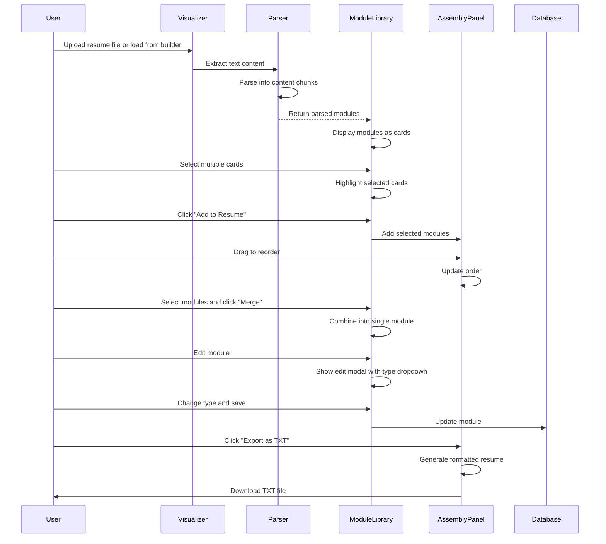
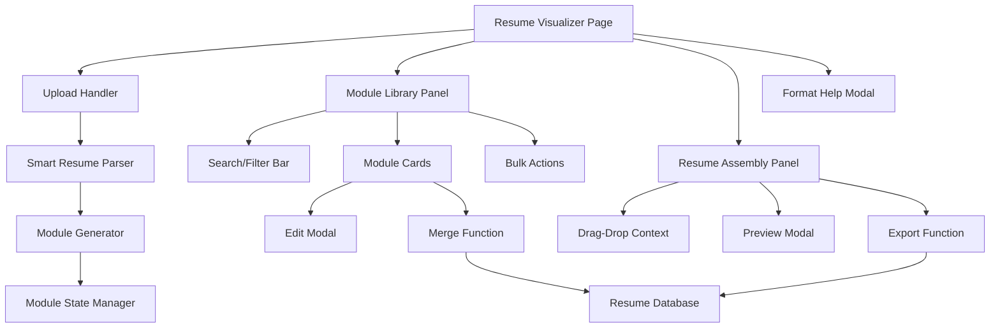

# Design Document: Resume Content Visualizer

## Overview

A list-based card interface that transforms the linear resume upload flow into an interactive visual experience. Users upload resumes, see content parsed into color-coded module cards, select multiple cards, merge them, reclassify types, and assemble tailored resume versions. The interface features a two-panel layout: Module Library (left) for browsing and selecting, and Resume Assembly (right) for drag-and-drop reordering. Inspired by NeuroFlow's clean card-based interface with a cyberpunk aesthetic matching the existing app theme.

## Main Algorithm/Workflow



## Architecture



## Components and Interfaces

### Component 1: ResumeVisualizer (Main Container)

**Purpose**: Main page component that orchestrates the list-based visualization experience

**Interface**:
```typescript
interface ResumeVisualizerProps {
  user: User;
}

interface ResumeVisualizerState {
  modules: Module[];
  selectedIds: string[];
  assemblyPalette: Module[];
  searchQuery: string;
  filterType: string;
  showNewNodeModal: boolean;
  showPreview: boolean;
  showFormatHelp: boolean;
  editingId: string | null;
  isProcessing: boolean;
}
```

**Responsibilities**:
- Manage overall state (modules, selections, assembly)
- Coordinate between library and assembly panels
- Handle file upload and parsing
- Load existing modules from database

### Component 2: ModuleLibrary (Left Panel)

**Purpose**: Display all modules as cards with search, filter, and bulk actions

**Interface**:
```typescript
interface ModuleLibraryProps {
  modules: Module[];
  selectedIds: string[];
  onSelectModule: (id: string) => void;
  onSelectAll: () => void;
  onAddToAssembly: () => void;
  onMerge: () => void;
  onDelete: () => void;
  onEdit: (id: string) => void;
  searchQuery: string;
  filterType: string;
}
```

**Responsibilities**:
- Render module cards with type badges
- Handle multi-select with checkboxes
- Provide search and filter controls
- Show bulk action buttons (Add, Merge, Delete)
- Display "Load from Builder" and "Upload Resume" buttons
- Show "Format Help" button

### Component 3: ModuleCard

**Purpose**: Individual card representing a resume module

**Interface**:
```typescript
interface ModuleCardProps {
  module: Module;
  selected: boolean;
  onSelect: () => void;
  onEdit: () => void;
}

interface Module {
  id: string;
  type: ModuleType;
  content: any;
  moduleId?: string;
}

type ModuleType = 'name' | 'contact' | 'experience' | 'education' | 'skill' | 'certification' | 'summary';
```

**Responsibilities**:
- Display module label and details
- Show type badge with color coding
- Render checkbox for selection
- Show edit button
- Handle click for selection

### Component 4: ResumeAssembly (Right Panel)

**Purpose**: Drag-and-drop area for assembling resume from selected modules

**Interface**:
```typescript
interface ResumeAssemblyProps {
  assemblyPalette: Module[];
  onDragEnd: (result: DropResult) => void;
  onRemove: (id: string) => void;
  onPreview: () => void;
  onExport: () => void;
  onClear: () => void;
}
```

**Responsibilities**:
- Display assembled modules in order
- Enable drag-and-drop reordering (react-beautiful-dnd)
- Show remove button for each item
- Provide Preview, Export, and Clear buttons

### Component 5: EditModal

**Purpose**: Modal for editing module content and reclassifying type

**Interface**:
```typescript
interface EditModalProps {
  module: Module;
  onSave: (id: string, type: ModuleType, content: string) => void;
  onCancel: () => void;
}
```

**Responsibilities**:
- Show type dropdown for reclassification
- Display content textarea (JSON format)
- Validate and save changes
- Handle cancel action

### Component 6: FormatHelpModal

**Purpose**: Modal displaying TXT file formatting guide

**Interface**:
```typescript
interface FormatHelpModalProps {
  onClose: () => void;
}
```

**Responsibilities**:
- Display recognized section headings
- Show example TXT format
- Provide formatting tips
- List supported module types

## Data Models

### Model 1: ContentNode

```typescript
interface ContentNode {
  id: string;
  type: NodeType;
  content: string;
  metadata: NodeMetadata;
  position: Position;
  size: number;
  color: string;
  clusterId?: string;
  createdAt: Date;
  resumeSourceId: string;
}

interface Position {
  x: number;
  y: number;
  z?: number; // For 3D isometric effect
}
```

**Validation Rules**:
- id must be unique UUID
- type must be valid NodeType
- content must be non-empty string
- size must be between 1-100
- position coordinates must be finite numbers

### Model 2: NodeCluster

```typescript
interface NodeCluster {
  id: string;
  nodeIds: string[];
  centroid: Position;
  label: string;
  color: string;
  importance: number;
}
```

**Validation Rules**:
- Must contain at least 2 nodes
- All nodeIds must reference existing nodes
- Label auto-generated from common keywords

### Model 3: ResumeSource

```typescript
interface ResumeSource {
  id: string;
  userId: string;
  filename: string;
  uploadedAt: Date;
  rawText: string;
  nodeIds: string[];
}
```

**Validation Rules**:
- userId must reference existing user
- filename must be non-empty
- rawText must be non-empty

## Algorithmic Pseudocode

### Main Processing Algorithm

```typescript
async function processResumeUpload(file: File): Promise<ContentNode[]> {
  // Precondition: file is valid PDF/DOCX/TXT
  // Postcondition: Returns array of ContentNode objects
  
  // Step 1: Extract text
  const rawText = await extractTextFromFile(file);
  
  // Step 2: Parse into structured data
  const parsedData = parseResumeText(rawText);
  
  // Step 3: Chunk content into nodes
  const chunks = chunkContent(parsedData);
  
  // Step 4: Generate nodes with metadata
  const nodes: ContentNode[] = [];
  
  for (const chunk of chunks) {
    const node = createContentNode(chunk);
    nodes.push(node);
  }
  
  // Step 5: Calculate importance scores
  calculateImportanceScores(nodes);
  
  // Step 6: Apply force-directed layout
  const positions = calculateForceDirectedLayout(nodes);
  
  for (let i = 0; i < nodes.length; i++) {
    nodes[i].position = positions[i];
  }
  
  // Step 7: Apply clustering
  const clusters = applyClustering(nodes);
  
  for (const cluster of clusters) {
    for (const nodeId of cluster.nodeIds) {
      const node = nodes.find(n => n.id === nodeId);
      if (node) {
        node.clusterId = cluster.id;
      }
    }
  }
  
  return nodes;
}
```

**Preconditions**:
- file is a valid resume file (PDF, DOCX, or TXT)
- file size is under 5MB
- extractTextFromFile function is available

**Postconditions**:
- Returns non-empty array of ContentNode objects
- All nodes have valid positions
- All nodes have importance scores calculated
- Nodes are assigned to clusters

**Loop Invariants**:
- All processed nodes have valid metadata
- Node positions remain within canvas bounds

### Content Chunking Algorithm

```typescript
function chunkContent(parsedData: ParsedResumeData): ContentChunk[] {
  // Precondition: parsedData contains valid resume sections
  // Postcondition: Returns array of content chunks
  
  const chunks: ContentChunk[] = [];
  
  // Chunk experience entries
  for (const exp of parsedData.experience) {
    // Add company/position as one chunk
    chunks.push({
      type: 'experience',
      content: `${exp.position} at ${exp.company}`,
      metadata: {
        company: exp.company,
        dateRange: `${exp.startDate} - ${exp.endDate}`,
        keywords: extractKeywords(exp.position)
      }
    });
    
    // Add each achievement as separate chunk
    for (const achievement of exp.achievements) {
      chunks.push({
        type: 'experience',
        content: achievement,
        metadata: {
          company: exp.company,
          keywords: extractKeywords(achievement)
        }
      });
    }
  }
  
  // Chunk education entries
  for (const edu of parsedData.education) {
    chunks.push({
      type: 'education',
      content: `${edu.degree} from ${edu.institution}`,
      metadata: {
        institution: edu.institution,
        dateRange: `${edu.startDate} - ${edu.endDate}`,
        keywords: extractKeywords(edu.degree)
      }
    });
  }
  
  // Chunk skills (each skill as individual node)
  for (const [category, skills] of Object.entries(parsedData.skills)) {
    for (const skill of skills) {
      chunks.push({
        type: 'skill',
        content: skill,
        metadata: {
          category,
          keywords: [skill.toLowerCase()]
        }
      });
    }
  }
  
  // Chunk certifications
  for (const cert of parsedData.certifications) {
    chunks.push({
      type: 'certification',
      content: `${cert.name} - ${cert.issuer}`,
      metadata: {
        issuer: cert.issuer,
        dateRange: cert.date,
        keywords: extractKeywords(cert.name)
      }
    });
  }
  
  return chunks;
}
```

**Preconditions**:
- parsedData is a valid ParsedResumeData object
- All arrays in parsedData are defined (may be empty)

**Postconditions**:
- Returns array of ContentChunk objects
- Each chunk has valid type and content
- Metadata is populated for all chunks

### Force-Directed Layout Algorithm

```typescript
function calculateForceDirectedLayout(
  nodes: ContentNode[],
  iterations: number = 100
): Position[] {
  // Precondition: nodes array is non-empty
  // Postcondition: Returns array of positions, one per node
  
  const positions: Position[] = [];
  const forces: Position[] = [];
  
  // Initialize random positions
  for (let i = 0; i < nodes.length; i++) {
    positions[i] = {
      x: Math.random() * 1000,
      y: Math.random() * 1000,
      z: 0
    };
    forces[i] = { x: 0, y: 0, z: 0 };
  }
  
  const REPULSION = 5000;
  const ATTRACTION = 0.01;
  const DAMPING = 0.9;
  
  // Iterate to find equilibrium
  for (let iter = 0; iter < iterations; iter++) {
    // Reset forces
    for (let i = 0; i < nodes.length; i++) {
      forces[i] = { x: 0, y: 0, z: 0 };
    }
    
    // Calculate repulsion between all nodes
    for (let i = 0; i < nodes.length; i++) {
      for (let j = i + 1; j < nodes.length; j++) {
        const dx = positions[j].x - positions[i].x;
        const dy = positions[j].y - positions[i].y;
        const distance = Math.sqrt(dx * dx + dy * dy);
        
        if (distance > 0) {
          const force = REPULSION / (distance * distance);
          const fx = (dx / distance) * force;
          const fy = (dy / distance) * force;
          
          forces[i].x -= fx;
          forces[i].y -= fy;
          forces[j].x += fx;
          forces[j].y += fy;
        }
      }
    }
    
    // Calculate attraction for related nodes (same type or keywords)
    for (let i = 0; i < nodes.length; i++) {
      for (let j = i + 1; j < nodes.length; j++) {
        const related = areNodesRelated(nodes[i], nodes[j]);
        
        if (related) {
          const dx = positions[j].x - positions[i].x;
          const dy = positions[j].y - positions[i].y;
          const distance = Math.sqrt(dx * dx + dy * dy);
          
          const force = distance * ATTRACTION;
          const fx = (dx / distance) * force;
          const fy = (dy / distance) * force;
          
          forces[i].x += fx;
          forces[i].y += fy;
          forces[j].x -= fx;
          forces[j].y -= fy;
        }
      }
    }
    
    // Apply forces with damping
    for (let i = 0; i < nodes.length; i++) {
      positions[i].x += forces[i].x * DAMPING;
      positions[i].y += forces[i].y * DAMPING;
    }
  }
  
  return positions;
}
```

**Preconditions**:
- nodes array is non-empty
- iterations is a positive integer
- All nodes have valid metadata

**Postconditions**:
- Returns array of Position objects equal in length to nodes
- All positions have finite x, y coordinates
- Related nodes are positioned closer together

**Loop Invariants**:
- positions array length equals nodes array length
- All position coordinates remain finite

### Clustering Algorithm (K-Means)

```typescript
function applyClustering(
  nodes: ContentNode[],
  k: number = 5
): NodeCluster[] {
  // Precondition: nodes array is non-empty, k > 0
  // Postcondition: Returns k clusters with assigned nodes
  
  const clusters: NodeCluster[] = [];
  
  // Initialize k random centroids
  const centroids: Position[] = [];
  for (let i = 0; i < k; i++) {
    const randomNode = nodes[Math.floor(Math.random() * nodes.length)];
    centroids[i] = { ...randomNode.position };
  }
  
  const MAX_ITERATIONS = 50;
  let converged = false;
  
  for (let iter = 0; iter < MAX_ITERATIONS && !converged; iter++) {
    // Assign nodes to nearest centroid
    const assignments: number[] = [];
    
    for (let i = 0; i < nodes.length; i++) {
      let minDist = Infinity;
      let nearestCluster = 0;
      
      for (let j = 0; j < k; j++) {
        const dist = distance(nodes[i].position, centroids[j]);
        if (dist < minDist) {
          minDist = dist;
          nearestCluster = j;
        }
      }
      
      assignments[i] = nearestCluster;
    }
    
    // Recalculate centroids
    const newCentroids: Position[] = [];
    for (let j = 0; j < k; j++) {
      const clusterNodes = nodes.filter((_, i) => assignments[i] === j);
      
      if (clusterNodes.length > 0) {
        const avgX = clusterNodes.reduce((sum, n) => sum + n.position.x, 0) / clusterNodes.length;
        const avgY = clusterNodes.reduce((sum, n) => sum + n.position.y, 0) / clusterNodes.length;
        newCentroids[j] = { x: avgX, y: avgY, z: 0 };
      } else {
        newCentroids[j] = centroids[j];
      }
    }
    
    // Check convergence
    converged = true;
    for (let j = 0; j < k; j++) {
      if (distance(centroids[j], newCentroids[j]) > 1) {
        converged = false;
        break;
      }
    }
    
    centroids.splice(0, k, ...newCentroids);
  }
  
  // Create cluster objects
  for (let j = 0; j < k; j++) {
    const clusterNodeIds = nodes
      .map((n, i) => ({ node: n, assignment: assignments[i] }))
      .filter(({ assignment }) => assignment === j)
      .map(({ node }) => node.id);
    
    if (clusterNodeIds.length > 0) {
      clusters.push({
        id: `cluster-${j}`,
        nodeIds: clusterNodeIds,
        centroid: centroids[j],
        label: generateClusterLabel(clusterNodeIds, nodes),
        color: getClusterColor(j),
        importance: calculateClusterImportance(clusterNodeIds, nodes)
      });
    }
  }
  
  return clusters;
}
```

**Preconditions**:
- nodes array is non-empty
- k is a positive integer less than nodes.length
- All nodes have valid positions

**Postconditions**:
- Returns array of NodeCluster objects
- Each node is assigned to exactly one cluster
- Clusters have meaningful labels

**Loop Invariants**:
- assignments array length equals nodes array length
- All assignment values are between 0 and k-1
- Centroids array length equals k

## Key Functions with Formal Specifications

### Function 1: createContentNode()

```typescript
function createContentNode(chunk: ContentChunk): ContentNode
```

**Preconditions:**
- chunk is a valid ContentChunk object
- chunk.content is non-empty string
- chunk.type is a valid NodeType

**Postconditions:**
- Returns valid ContentNode object
- Node has unique UUID
- Node size is calculated based on content length
- Node color matches type

**Loop Invariants:** N/A

### Function 2: calculateImportanceScores()

```typescript
function calculateImportanceScores(nodes: ContentNode[]): void
```

**Preconditions:**
- nodes array is non-empty
- All nodes have valid metadata

**Postconditions:**
- All nodes have importance score between 0 and 1
- Scores are normalized across all nodes
- Mutates nodes array in place

**Loop Invariants:**
- All processed nodes have importance score set
- Importance scores remain between 0 and 1

### Function 3: mergeNodesIntoModule()

```typescript
async function mergeNodesIntoModule(
  nodeIds: string[],
  nodes: ContentNode[]
): Promise<ResumeModule>
```

**Preconditions:**
- nodeIds array is non-empty
- All nodeIds reference existing nodes
- All referenced nodes have same type

**Postconditions:**
- Returns valid ResumeModule object
- Module is saved to database
- Module content is merged from all nodes

**Loop Invariants:**
- All processed nodes contribute to module content

## Example Usage

```typescript
// Example 1: Upload and visualize resume
const visualizer = new ResumeVisualizer({ user });

const file = await selectFile();
const nodes = await visualizer.processUpload(file);
visualizer.renderNodes(nodes);

// Example 2: Search and filter nodes
visualizer.search('javascript');
visualizer.filter({
  types: ['skill', 'experience'],
  importanceMin: 0.5
});

// Example 3: Create module from selected nodes
const selectedNodes = visualizer.getSelectedNodes();
const module = await visualizer.createModule(selectedNodes);

// Example 4: Assemble resume version
const modules = visualizer.getModules();
const version = await visualizer.createVersion({
  name: 'Frontend Developer Resume',
  moduleIds: modules.map(m => m.id),
  templateId: 'default'
});

// Example 5: Export to ATS
await visualizer.exportToATS(version.id);
```

## Correctness Properties

### Property 1: Node Uniqueness
```typescript
// All nodes must have unique IDs
∀ i, j ∈ nodes: i ≠ j ⟹ nodes[i].id ≠ nodes[j].id
```

### Property 2: Type Consistency
```typescript
// All nodes in a module must have the same type
∀ module ∈ modules:
  ∀ nodeId ∈ module.sourceNodeIds:
    nodes.find(n => n.id === nodeId).type === module.type
```

### Property 3: Position Validity
```typescript
// All node positions must be finite numbers
∀ node ∈ nodes:
  isFinite(node.position.x) ∧ isFinite(node.position.y)
```

### Property 4: Cluster Coverage
```typescript
// All nodes must be assigned to exactly one cluster
∀ node ∈ nodes: ∃! cluster ∈ clusters: node.id ∈ cluster.nodeIds
```

### Property 5: Importance Range
```typescript
// All importance scores must be between 0 and 1
∀ node ∈ nodes: 0 ≤ node.metadata.importance ≤ 1
```

## Error Handling

### Error Scenario 1: Invalid File Upload

**Condition**: User uploads unsupported file type or file exceeds size limit
**Response**: Display error toast with specific message
**Recovery**: Allow user to upload different file

### Error Scenario 2: Parsing Failure

**Condition**: Resume parser cannot extract meaningful content
**Response**: Show warning and allow manual node creation
**Recovery**: Provide empty canvas with "Add Node" button

### Error Scenario 3: Layout Calculation Timeout

**Condition**: Force-directed layout doesn't converge within time limit
**Response**: Use last calculated positions
**Recovery**: Allow manual node repositioning

### Error Scenario 4: Module Creation Conflict

**Condition**: User tries to merge nodes of different types
**Response**: Show error message explaining type mismatch
**Recovery**: Deselect incompatible nodes

### Error Scenario 5: Database Save Failure

**Condition**: Network error or database constraint violation
**Response**: Show error toast and retry with exponential backoff
**Recovery**: Cache changes locally and sync when connection restored

## Testing Strategy

### Unit Testing Approach

Test individual functions in isolation:
- Content chunking logic
- Importance score calculation
- Force-directed layout algorithm
- Clustering algorithm
- Node creation and validation
- Search and filter functions

Use Jest with React Testing Library for component tests:
- NodeCanvas rendering
- ContentNode interactions
- ControlPanel state management
- ModuleAssemblyPanel workflows

Mock external dependencies:
- File upload API
- Resume parser
- Database operations

### Property-Based Testing Approach

**Property Test Library**: fast-check (already in package.json)

Test invariants with generated data:
- Node uniqueness property
- Position validity property
- Importance range property
- Cluster coverage property
- Type consistency property

Generate random resume data and verify:
- All nodes have valid positions after layout
- Clustering assigns all nodes
- Search returns correct subset
- Filter maintains type consistency

### Integration Testing Approach

Test complete workflows:
1. Upload resume → Parse → Generate nodes → Render canvas
2. Select nodes → Create module → Save to database
3. Search nodes → Filter results → Select → Create module
4. Assemble version → Export to ATS/PDF

Test React Flow integration:
- Drag-and-drop functionality
- Multi-select behavior
- Zoom and pan controls
- Custom node rendering

Test database integration:
- Save and load nodes
- Create and retrieve modules
- Version management
- Concurrent user operations

## Performance Considerations

### Canvas Rendering
- Use React Flow's built-in virtualization for large node counts (>1000 nodes)
- Implement level-of-detail rendering (hide labels when zoomed out)
- Use CSS transforms for GPU-accelerated animations
- Debounce layout recalculation on window resize

### Layout Calculation
- Run force-directed algorithm in Web Worker to avoid blocking UI
- Cache layout results for unchanged node sets
- Use spatial indexing (quadtree) for collision detection
- Limit iterations based on convergence threshold

### Search and Filter
- Index nodes by keywords using inverted index
- Implement fuzzy search with Levenshtein distance
- Debounce search input (300ms)
- Use memoization for filter results

### Memory Management
- Lazy load node content (show preview, load full on hover)
- Unload off-screen nodes when zoomed in
- Clear undo/redo history after 50 operations
- Use object pooling for frequently created/destroyed nodes

## Security Considerations

### File Upload Security
- Validate file type on client and server
- Scan uploaded files for malware
- Limit file size to 5MB
- Sanitize extracted text content

### XSS Prevention
- Sanitize all user-generated content before rendering
- Use React's built-in XSS protection
- Escape HTML in node content
- Validate all input fields

### Data Privacy
- Store resume content encrypted at rest
- Use HTTPS for all API calls
- Implement row-level security in Supabase
- Allow users to delete all resume data

### Access Control
- Verify user authentication before loading data
- Ensure users can only access their own resumes
- Implement rate limiting on API endpoints
- Log all data access for audit trail

## Dependencies

### Core Libraries
- react-beautiful-dnd (^13.1.1) - Drag-and-drop for assembly panel
- lucide-react (^0.469.0) - Icons

### Existing Dependencies (Already in package.json)
- react (^18.3.1)
- react-dom (^18.3.1)
- @supabase/supabase-js (^2.48.0)
- pdfjs-dist (^3.11.174) - PDF parsing
- mammoth (^1.11.0) - DOCX parsing

### Development Dependencies
- vitest (^4.0.18) - Already in package.json
- fast-check (^4.5.3) - Already in package.json
- @testing-library/react (^16.3.2) - Already in package.json

### Database Schema
Uses existing `resume_modules` table from Resume Builder:
- id (uuid)
- user_id (uuid)
- type (text)
- content (jsonb)
- created_at (timestamp)
- updated_at (timestamp)
